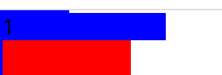
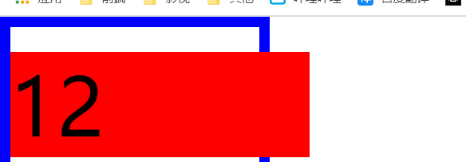

#  CSS-flex布局

```
https://developer.mozilla.org/zh-CN/docs/Web/CSS/CSS_Flexible_Box_Layout/Basic_Concepts_of_Flexbox
```

​		flex就是弹性布局。

​		基本使用

```
display: flex;
```


## 主轴

​		`flex-direction` 定义主轴

```
row，row-reverse
代表inline，横向延申
```

```
column，column-reverse
代表black，竖向排列
```

​		其中 `reverse `代表翻转，就是反过来的排列顺序


## 交叉轴，副轴

​		就是和主轴垂直的轴

​		如果主轴是横轴，那么交叉轴就是数轴。


# 当使用了 Flex容器

​		在定义了 `display: flex;` 之后的一些默认行为

```
元素排列一行，(因为 flex-direction 的默认值是 row )
从主轴的起始线开始，这里起始线一般就是如果是row，代表了从左向右，其他的	情况查看MDN文档
元素不会再主维度拉伸，但是可以缩小
元素被拉伸来填充交叉轴大小
flex-basis 为 auto
flex-wrap 为 nowrap
```


# 对于flex属性值的行为

## flex-direction 设置主轴

​		对定义了 `display: flex;` 的元素使用

```
flex-direction
	row
		横向，从左到右
	row-reverse
		横向，从右到左
		对于行内块元素和话，宽度的计算是和 Colum-reverse 类似的。
	column
		纵向，从上到下
	column-reverse
		纵向，从下到上
		对于没有设置高度的，就会按照最小高度进行计算，(意思就是说，高度和column的一样，只是方向反了而已。)
```


## flex-wrap 实现多行flex

​		对定义了 `display: flex;` 的元素使用

​		在这样做的时候，您应该把每一行看作一个新的`flex`容器。 任何空间分布都将在该行上发生，而不影响该空间分布的其他行。

```
wrap
	会换行，而不是进行缩小
nowrap
	不会换行，会使用缩小的规则进行缩小，对于不能缩小的，会导致溢出。
```

**注意：**

* 如果在使用 wrap 时，使用了 flex:1， 时，这个时候就需要注意要不要定义 flex-basis 了。

​			**原因**： 因为 `flex: 1`; 对应了 `flex-grow: 1` & `flex-shrink: 1` && `flex-basis: 0`  ，所以其实原因就是 flex-basis 为 0 了。所以如果不自己定义一个 flex-basis 的话，就不会进行换行。

* 还有就是，对于每一个换行之后的元素，每一行都算是一个弹性行，所以对于以下代码

  * ```
    flex: 1 1 160px;
    
    子元素在160px，换行之后，会对每一行的每个元素进行 扩张 和 收缩 的重新计算。
    ```

  * ```
    参考 MDN 链接：
    https://developer.mozilla.org/zh-CN/docs/Web/CSS/CSS_Flexible_Box_Layout/Mastering_Wrapping_of_Flex_Items
    ```


## 简写属性 flex-flow

​		对定义了 `display: flex;` 的元素使用

​		是 `flex-direction` 和 `flex-wrap` 的组合

​		对于没有写的，就会使用默认值：row 和 nowrap

**注：**

* 从谷歌浏览器的显示来说:
  * 如果设置 `flex-flow: column; `  ，就直接代表了 `flex-direction: column;` ，而不会定义 `flex-wrap`
  * 如果设置 `flex-flow: wrap; `  ，就代表了 `flex-direction: initial;` 而  `flex-flow: wrap; ` 


## flex-basis 元素的空间大小

​		该属性的默认值是 `auto` ，此时，浏览器会检查这个元素是否具有确定的尺寸(width / heght ，这个看是使用 row 还是 Colum)，如果**具有确定的尺寸**，就会将该值设置为 flex-basis。如果没有设定尺寸，就会采用**元素内容的尺寸**。这里的元素内容尺寸，不会因为 盒模型 的模式而变化，就是只会计算content 的部分。


## flex-grow 延展比例

​		简单来说，这个是一个比例，对于存在可用空间的(可用空间：就是指在使用之后，父元素还存在剩余的空间。)， 子元素会根据这个比例将可用空间占据。

​		比如：两个子元素，一个为 1， 一个为 2，父元素的可用空间为 90，那么第一个就会扩张 1/(1+2) * 90 ， 第二个就会扩张 2/(1+2) * 90 。


## flex-shrink 收缩比例

​		简单来说，就会对于如果容器不够排列 flex元素的空间。那么就会按照比例进行收缩。默认为1

​		计算方式： 超出的部分记为超过空间 **x**，每个子元素占有 shrink的比例总和为 y，所以值为 **z = x/y * 每个元素的shrink值**，然后再用元素的值**减 z**。


**注意：**

* `flex-grow` && `flex-shrink` 的值要为正数。

* ```
  https://developer.mozilla.org/zh-CN/docs/Web/CSS/CSS_Flexible_Box_Layout/Controlling_Ratios_of_Flex_Items_Along_the_Main_Ax
  ```

  


## 简写属性 flex

​		对弹性布局的子元素使用。

​		包含了： `flex-grow`  、 `flex-shrink` 和 `flex-basis` 

​		对于每个属性的值，都有理解了。我们就说几个简写的代表意思

- `flex: initial`
  - 代表初始值：`flex: 0 1 auto`
- `flex: auto`
  - 代表 `flex: 1 1 auto`
- `flex: none`
  - 代表 `flex: 0 0 auto`
- `flex: <positive-number>`
  - 代表 `flex: x x 0`

```
https://developer.mozilla.org/zh-CN/docs/Web/CSS/CSS_Flexible_Box_Layout/Basic_Concepts_of_Flexbox#flex_%E5%85%83%E7%B4%A0%E4%B8%8A%E7%9A%84%E5%B1%9E%E6%80%A7
```


# 对于flex的溢出：

```
https://blog.csdn.net/qq_33539213/article/details/101676146
这个为什么会有这个效果，理解了 看看
```


### 方式一

```
对一个元素设置了flex布局，其中的子元素的子元素的宽度可以造成溢出
```

```
div.father
	div.children
	
father 元素设置了弹性布局， children 元素只设置一个宽度，会发现 children 的宽度不会高于father的宽度。主要是因为涉及了
```


```
但是
div.father
	div.children
		div.cChildren

这个对于 cChildren 的宽度就会将 children 的宽度顶出来，造成溢出。
其中，这里的宽度，如果 cChildren 大于了 father 就会将 cChildren 和 children 顶出来。
但是如果 cChildren 大于了 children 的话，就会再 children 到达他所定义的宽度之后，就不会继续扩张了。
```





​		但是这里的计算方式我没有理解到为什么。


### 方式二

​		设置 `flex-shrink: 0;` 属性，因为设置了0之后代表了不会对超过的部分进行处理。


### 方式三

​		这个是文字超出导致的溢出，就是如果文字，或者 img图片的设置超过了宽高也会造成溢出。


### 方式四

​		我们可以发现，flex 对于溢出的处理，默认只是针对于主轴，所以对于侧轴是没有溢出处理的。

```
.father {
    display: flex;
    flex-direction: column;
    width: 50px;
}

.children {
	width: 60px;
}
```




