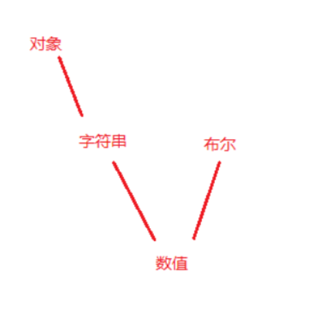

# JavaScript类型转换

​		本文参考文章

```
https://developer.mozilla.org/zh-CN/docs/Web/JavaScript/Equality_comparisons_and_sameness
```


## 非严格相等判断中的隐式类型转换

​		因为JavaScript的非严格相等，所以存在在比较时进行类型转换。

转换规则：

* null 和 undefined 互为相等。和基本数据类型为false，引用数据类型通过 isFalsy 来进行判断（Falsy代表的是在Boolean属性中被认为是false的值）

* 其他类型和number的比较，和基本数据类型会转为数字，引用类型则通过ToPrimitive转换为基本类型然后再进行比较。

  * ```
    https://developer.mozilla.org/zh-CN/docs/Web/JavaScript/Reference/Global_Objects/Symbol/toPrimitive
    ```

  * ```
    具体的我们后续再继续了解。
    
    let a = {
      value: 1,
      [Symbol.toPrimitive](hint) {
        console.log('hint', hint)
    
        if (hint == 'number') return this.value
        if (hint == 'string') return '2'
        return true
      },
    }
    let b = 12
    
    console.log(a == b)
    ```

  * 我们现在就先知道这个 toPrimitive 的一个作用是什么就好。他会将对象转为一个基本的数据类型。对于一个对象，会先通过 toPrimitive 调用 valueOf 方法转换为 基本数据类型，如果不能，那么便通过toString 转换为基本数据类型，否则便会报错。但是对于date 类型就会反过来进行调用。（有人说是因为date的数值转化较大，所以没有意义转化为数值）

* 布尔类型的比较，其他类型都转化为number，对象使用ToPrimitive，同时布尔转化为number

所以大致一个转化的思路就是

undefined 和 null 将为 空。

引用类型和其他类型会通过primitive转化为基本类型

其他的有number，以number为主。

布尔和string要转化为number

有一个图也进行了说明：




|      |           | B         | 被      | 比                    | 较                            | 值                              | B                               |
| ---- | --------- | --------- | ------- | --------------------- | ----------------------------- | ------------------------------- | ------------------------------- |
| A    |           | Undefined | Null    | Number                | String                        | Boolean                         | Object                          |
| 被   | Undefined | `true`    | `true`  | `false`               | `false`                       | `false`                         | `IsFalsy(B)`                    |
| 比   | Null      | `true`    | `true`  | `false`               | `false`                       | `false`                         | `IsFalsy(B)`                    |
| 较   | Number    | `false`   | `false` | `A === B`             | `A === ToNumber(B)`           | `A=== ToNumber(B)`              | `A== ToPrimitive(B)`            |
| 值   | String    | `false`   | `false` | `ToNumber(A) === B`   | `A === B`                     | `ToNumber(A) === ToNumber(B)`   | `ToPrimitive(B) == A`           |
| A    | Boolean   | `false`   | `false` | `ToNumber(A) === B`   | `ToNumber(A) === ToNumber(B)` | `A === B`                       | `ToNumber(A) == ToPrimitive(B)` |
|      | Object    | `false`   | `false` | `ToPrimitive(A) == B` | `ToPrimitive(A) == B`         | `ToPrimitive(A) == ToNumber(B)` | `A === B`                       |


## 几个案例测试：

​		这个是我笔试的时候遇到的题目案例：

```
console.log([] == ![])
	对象和布尔之间的。第二个 ![] 属于 false
	所以就是 [] 和 false 的比较，[] toString ''
	然后字符串和布尔的比较，转number，都为 0
	所以为 true

console.log([''] == false)
	第二个一样：[''] 的 toString 为 ''
	所以也为true
	
console.log([] !== [])
	对象的严格比较，直接比较地址的引用是否为同一个地址。
	所以也为true

console.log([''] == [])
	对象的比较，直接比较地址
	false
```


