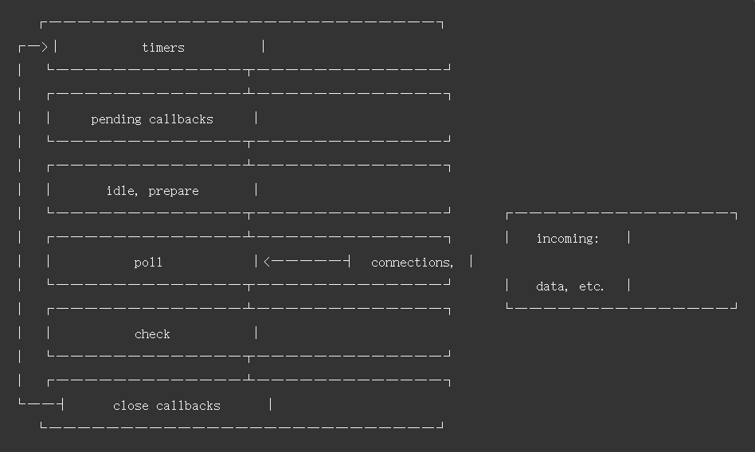

#  JavaScript的事件循环机制

这里分为 NodeJS 和 浏览器环境

​	因为 Node JS虽然是使用了 浏览器的V8处理器 作为一个JavaScript的解释器，但是其中的IO处理实则还是使用的 libuv 引擎。


## 浏览器的事件循环

​		这里先引入一个概念，叫做**任务队列(Task Queue)**，简单来说就是维护了一个需要执行的函数的一个队列。

​		在这里，任务队列又分为了**宏任务队列(macro task)**和**微任务队列(micro task)**。


​		简单来说就是JavaScript，在执行的过程中，如果遇到了异步处理，就会将其推入任务队列。然后继续执行后面的函数。直到执行结束，然后才会调用任务队列的任务进行执行。

​		这里是先调用的 微任务队列的方法，先执行，直至微任务队列为空，这里如果产生了微任务，也会即刻放入这个微任务队列中，因为这是一个的队列。微任务队列执行结束，然后就会从宏任务队列中取出一个来进行执行，方式就如同上面那样，这样即产生了事件的循环。


​		**常见宏任务**：

```
script (可以理解为外层同步代码)、setTimeout/setInterval、setImmediate(Node.js)、I/O、UI事件、postMessage。
```

​		因为在这里，我们如果将最外层的同步代码视为第一个宏任务队列的话，我们就可以这样理解，先取出一个宏任务，然后再执行，然后再执行微任务，然后又取出宏任务这样循环。

​		**常见微任务**：

```
Promise.then、process.nextTick(Node.js) 这里nextTick会先于微任务执行、Object.observe、MutaionObserver。
```

​		这里 Promise里面算是一个同步的代码，只是then方法是一个异步的。所以then方法算是一个微任务。


## Node JS的事件循环

 **官方文档**：

```
https://nodejs.org/zh-cn/docs/guides/event-loop-timers-and-nexttick/
```

事件循环操作顺序的简化图



一个框，便为事件循环的一个阶段


​		每个阶段都有一个FIFO(first input first output，就是队列) 队列，通常情况下，当进入给定的阶段，将执行该阶段的行为。然后执行回调，直到队列用尽或者最大回调数的执行。然后事件循环将移动到下一阶段。

​		由于这些操作中的任何一个都可能调度 *更多的* 操作和由内核排列在**轮询**阶段被处理的新事件， 且在处理轮询中的事件时，轮询事件可以排队。因此，长时间运行的回调可以允许轮询阶段运行长于计时器的阈值时间。有关详细信息，请参阅 [**计时器**](https://nodejs.org/zh-cn/docs/guides/event-loop-timers-and-nexttick/#timers) 和 [**轮询**](https://nodejs.org/zh-cn/docs/guides/event-loop-timers-and-nexttick/#poll) 部分。**（没看懂，直接复制的原文，后续再解读）**


### **阶段概述**：

* 定时器（timers）： 本阶段执行已经被 `setTimeout()` 和 `setInterval()` 的调度回调函数。
* 待定回调（pending callbacks）：执行延迟到下一个循环迭代的I/O回调
* idle，prepare：仅系统内部使用
* 轮询（poll）：检索新的I/O事件；执行与I/O相关的回调（几乎所有情况下，除了关闭的回调函数，那些由计时器和`setImmediate`调度的之外），其余情况node将在适当的时候在此阻塞
* 检测（check）：`setImmediate()` 回调函数在这里执行。
* 关闭的回调函数（close callbacks）：一些关闭的回调函数，如：`socket.on('close', ...)`。

在每次运行的事件循环之间，Node JS检查它是否在等待任何异步I/O或者计时器，如果没有，则完全关闭。


### 阶段的详细概述

#### 定时器

​		可以执行所提供回调的阈值，而不是执行的确切事件，是指在时间间隔后，回调将尽快的执行。但是，操作系统或其他正在运行的回调可能会延迟它们的执行。


#### 待定回调

​		对某些系统操作（如 TCP 错误类型）执行回调。例如，如果 TCP 套接字在尝试连接时接收到 `ECONNREFUSED`，则某些 *nix 的系统希望等待报告错误。


#### 轮询

两个重要的功能：

* 计算应该 阻塞和轮询I/O的时间。
* 处理轮询队列里的事件。

当事件循环进入轮询阶段，且没有被调度的计时器时，将发生以下两种情况：

* 如果轮询队列不是空的，事件循环将循环访问回调队列并同步执行它们，直到队列已用尽，或者达到了与系统相关的硬性限制。
  * 为了防止轮询阶段饿死事件循环，[libuv](https://libuv.org/)（实现 Node.js 事件循环和平台的所有异步行为的 C 函数库），在停止轮询以获得更多事件之前，还有一个硬性最大值（依赖于系统）。
* *如果 **轮询** 队列 **是空的*** ，还有两件事发生：
  * 如果脚本被 `setImmediate()` 调度，则事件循环将结束 **轮询** 阶段，并继续 **检查** 阶段以执行那些被调度的脚本。
  * 如果脚本 **未被** `setImmediate()`调度，则事件循环将等待回调被添加到队列中，然后立即执行。

一旦 **轮询** 队列为空，事件循环将检查 _已达到时间阈值的计时器_。如果一个或多个计时器已准备就绪，则事件循环将绕回计时器阶段以执行这些计时器的回调。


#### 检查阶段

​		此阶段允许人员在轮询阶段完成后立即执行回调。如果轮询阶段变为空闲状态，并且脚本使用 `setImmediate()` 后被排列在队列中，则事件循环可能继续到 **检查** 阶段而不是等待。

​		`setImmediate()` 实际上是一个在事件循环的单独阶段运行的特殊计时器。它使用一个 libuv API 来安排回调在 **轮询** 阶段完成后执行。


#### 关闭的回调函数

​		如果套接字或处理函数突然关闭（例如 `socket.destroy()`），则`'close'` 事件将在这个阶段发出。否则它将通过 `process.nextTick()` 发出。


​		任何时候在给定的阶段中调用 `process.nextTick()`，所有传递到 `process.nextTick()` 的回调将在事件循环继续之前解析。

