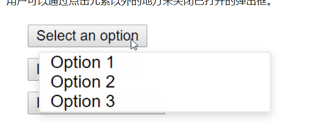

#  React 高级指引

## 无障碍

### 语义化的 HTML

​		简单来说，就是如果对于比如 dl dt dd，其中这样的构造。

​		正常的使用 ，就是如同下面这样，因为return需要一个根组件，但是我们有两个标签，所以需要将其用div包含起来。

​		但是这样就会破坏语义性。所以就需要使用一个 Fragment 标签，其语义和template标签可以说是一样的。

```
function ListItem({ item }) {
  return (
    <div>
      <dt>{item.term}</dt>
      <dd>{item.description}</dd>
    </div>
  );
}

function Glossary(props) {
  return (
    <dl>
      {props.items.map(item => (
        <ListItem item={item} key={item.id} />
      ))}
    </dl>
  );
}
```

```
import React, { Fragment } from 'react';

function ListItem({ item }) {
  return (
    <Fragment>
      <dt>{item.term}</dt>
      <dd>{item.description}</dd>
    </Fragment>
  );
}

function Glossary(props) {
  return (
    <dl>
      {props.items.map(item => (
        <ListItem item={item} key={item.id} />
      ))}
    </dl>
  );
}
```


​		和其他的元素一样，你可以把一系列的对象映射到一个 fragment 的数组中。

```
function Glossary(props) {
  return (
    <dl>
      {props.items.map(item => (
        // Fragments should also have a `key` prop when mapping collections
        <Fragment key={item.id}>          <dt>{item.term}</dt>
          <dd>{item.description}</dd>
        </Fragment>      ))}
    </dl>
  );
}
```

​		当你不需要在 fragment 标签中添加任何 prop 且你的工具支持的时候，你可以使用 [短语法](https://zh-hans.reactjs.org/docs/fragments.html#short-syntax)：

```
function ListItem({ item }) {
  return (
    <>      <dt>{item.term}</dt>
      <dd>{item.description}</dd>
    </>  );
}
```


### 控制焦点

​		我们可以使用 tab 键来进行焦点的切换。其中可以切换的是 a标签，input标签等可以获取focus的标签。


### 使用程序管理焦点

​		简单来说，就是我们可以创建一个DOM元素ref，然后将其赋值给了ref。于是就可以通过 this.textInput.current 来获取当前DOM节点。

```
class CustomTextInput extends React.Component {
  constructor(props) {
    super(props);
    // 创造一个 textInput DOM 元素的 ref
    this.textInput = React.createRef();
  }
  render() {
  // 使用 `ref` 回调函数以在实例的一个变量中存储文本输入 DOM 元素
  //（比如，this.textInput）。
    return (
      <input
        type="text"
        ref={this.textInput}
      />
    );
  }
}
```

​		然后我们就可以在需要时于其他地方把焦点设置在这个组件上：

```
focus() {
  // 使用原始的 DOM API 显式地聚焦在 text input 上
  // 注意：我们通过访问 “current” 来获得 DOM 节点
  this.textInput.current.focus();
}
```

​		其大意和vue的ref一样，但是这里我们需要先通过React.createRef 来创建一个ref。然后再将其用ref赋值给标签则可以获得对应的DOM节点。

​		我们需要使用 current 来获取当前的节点。同时我们如果对一个值多次使用ref赋值，只有第一次的会有作用

```
我这里，div ref={this.textInput}
			CustomInput ref={this.textInput}
其最后的结果就是 div，current就只有这一个对象，并没有生成对应的多个对象出来。

class App extends React.Component<any, any> {
    private textInput : any

    constructor(props : any) {
        super(props);

        this.textInput = React.createRef();
    }

    render() {

    return (
        <div ref={this.textInput}>
            <CustomInput ref={this.textInput} inputRef={this.textInput}></CustomInput>
        </div>
    );
  }
}
```

​		通过暴露ref，来让父组件的ref传向子节点。

```
function CustomTextInput(props) {
  return (
    <div>
      <input ref={props.inputRef} />
    </div>
  );
}

class Parent extends React.Component {
  constructor(props) {
    super(props);
    this.inputElement = React.createRef();
  }
  render() {
    return (
      <CustomTextInput inputRef={this.inputElement} />
    );
  }
}

// 现在你就可以在需要时设置焦点了
this.inputElement.current.focus();
```




​		通过点击事件来让 ul 进行显示和隐藏，一般的想法就是使用click事件，设置一个Boolean值来进行显示和隐藏。

​		但是这样对于使用键盘的就不会过于的友好。因为这样点击事件启动之后，就需要其他的点击事件来进行操作会隐藏当前 ul 标签。

```
button的点击事件
onClickHandler() {
    this.setState(currentState => ({
      isOpen: !currentState.isOpen
    }));
  }

window对象监听点击事件。通过判断点击事件是否属于toggleContariner元素来确定是否需要隐藏。
  onClickOutsideHandler(event) {
    if (this.state.isOpen && !this.toggleContainer.current.contains(event.target)) {
      this.setState({ isOpen: false });
    }
```

​		所以我们可以使用 onBlur 和 onFocus 来完成这个效果。

​		我的思考是，直接添加 onBlur 和 onFocus 来进行判断，虽然这样对于button的点击事件就会一直处于focus状态。

​		官网的思路就是，click事件还是添加在button上面，然后使用focus和blur来进行事件的处理。但是这里存在一个问题，那就是对于focus和blur的事件需要有能够进行事件的才会使用，但是官网案例的显示是ul标签，不存在焦点事件，所以出现了问题。

​		通过官网并不是获取焦点就直接为true，而是使用了 settimeout方法。在get focus的时候清除定时器。

```
class BlurExample extends React.Component {
  constructor(props) {
    super(props);

    this.state = { isOpen: false };
    this.timeOutId = null;

    this.onClickHandler = this.onClickHandler.bind(this);
    this.onBlurHandler = this.onBlurHandler.bind(this);
    this.onFocusHandler = this.onFocusHandler.bind(this);
  }

  onClickHandler() {
    this.setState(currentState => ({
      isOpen: !currentState.isOpen
    }));
  }

  // 我们在下一个时间点使用 setTimeout 关闭弹窗。
  // 这是必要的，因为失去焦点事件会在新的焦点事件前被触发，
  // 我们需要通过这个步骤确认这个元素的一个子节点
  // 是否得到了焦点。
  onBlurHandler() {
    this.timeOutId = setTimeout(() => {
      this.setState({
        isOpen: false
      });
    });
  }

  // 如果一个子节点获得了焦点，不要关闭弹窗。
  onFocusHandler() {
    clearTimeout(this.timeOutId);
  }

  render() {
    // React 通过把失去焦点和获得焦点事件传输给父节点
    // 来帮助我们。
    return (
      <div onBlur={this.onBlurHandler}
           onFocus={this.onFocusHandler}>
        <button onClick={this.onClickHandler}
                aria-haspopup="true"
                aria-expanded={this.state.isOpen}>
          Select an option
        </button>
        {this.state.isOpen && (
          <ul>
            <li>Option 1</li>
            <li>Option 2</li>
            <li>Option 3</li>
          </ul>
        )}
      </div>
    );
  }
}
```


### 开发辅助

​		我们可以直接在 JSX 代码中检测一些无障碍复制功能。通常支持 JSX 的 IDE 会针对 ARIA roles，states 和 properties 提供智能检测。我们也可以使用以下工具：

#### eslint-plugin-jsx-a11y

​		ESLint 中的 [eslint-plugin-jsx-a11y](https://github.com/evcohen/eslint-plugin-jsx-a11y) 插件为你的 JSX 中的无障碍问题提供了 AST 的语法检测反馈。许多 IDE 都允许你把这些发现直接集成到代码分析和源文件窗口中。

​		 [Create React App](https://github.com/facebookincubator/create-react-app)中使用了这个插件中的一部分规则。如果你想启用更多的无障碍规则，你可以在项目的根目录中创建一个有如下内容的 `.eslintrc` 文件：

```
{
  "extends": ["react-app", "plugin:jsx-a11y/recommended"],
  "plugins": ["jsx-a11y"]
}
```

### 

## 代码分割

​		为了避免搞出大体积的代码包，在前期就思考该问题并对代码包进行分割是个不错的选择。 代码分割是由诸如 [Webpack](https://webpack.docschina.org/guides/code-splitting/)，[Rollup](https://rollupjs.org/guide/en/#code-splitting) 和 Browserify（[factor-bundle](https://github.com/browserify/factor-bundle)）这类打包器支持的一项技术，能够创建多个包并在运行时动态加载。

​		对你的应用进行代码分割能够帮助你“懒加载”当前用户所需要的内容，能够显著地提高你的应用性能。尽管并没有减少应用整体的代码体积，但你可以避免加载用户永远不需要的代码，并在初始加载的时候减少所需加载的代码量。

### import()

​		在你的应用中引入代码分割的最佳方式是通过动态 `import()` 语法。

​		**使用之前：**

```
import { add } from './math';

console.log(add(16, 26));
```

​		**使用之后：**

```
import("./math").then(math => {
  console.log(math.add(16, 26));
});
```

​		当 Webpack 解析到该语法时，会自动进行代码分割。如果你使用 Create React App，该功能已开箱即用，你可以[立刻使用](https://create-react-app.dev/docs/code-splitting/)该特性。[Next.js](https://nextjs.org/docs/advanced-features/dynamic-import) 也已支持该特性而无需进行配置。

​		如果你自己配置 Webpack，你可能要阅读下 Webpack 关于[代码分割](https://webpack.docschina.org/guides/code-splitting/)的指南。你的 Webpack 配置应该[类似于此](https://gist.github.com/gaearon/ca6e803f5c604d37468b0091d9959269)。

​		当使用 [Babel](https://babeljs.io/) 时，你要确保 Babel 能够解析动态 import 语法而不是将其进行转换。对于这一要求你需要 [@babel/plugin-syntax-dynamic-import](https://classic.yarnpkg.com/en/package/@babel/plugin-syntax-dynamic-import) 插件。


### React.lazy

> 注意:
>
> `React.lazy` 和 Suspense 技术还不支持服务端渲染。如果你想要在使用服务端渲染的应用中使用，我们推荐 [Loadable Components](https://github.com/gregberge/loadable-components) 这个库。它有一个很棒的[服务端渲染打包指南](https://loadable-components.com/docs/server-side-rendering/)。

**使用之前：**

```
import OtherComponent from './OtherComponent';
```

**使用之后：**

```
const OtherComponent = React.lazy(() => import('./OtherComponent'));
```

​		此代码将会在组件首次渲染时，自动导入包含 `OtherComponent` 组件的包。

​		`React.lazy` 接受一个函数，这个函数需要动态调用 `import()`。它必须返回一个 `Promise`，该 Promise 需要 resolve 一个 `default` export 的 React 组件。

​		然后应在 `Suspense` 组件中渲染 lazy 组件，如此使得我们可以使用在等待加载 lazy 组件时做优雅降级（如 loading 指示器等）。

```
import React, { Suspense } from 'react';

const OtherComponent = React.lazy(() => import('./OtherComponent'));

function MyComponent() {
  return (
    <div>
      <Suspense fallback={<div>Loading...</div>}>
        <OtherComponent />
      </Suspense>
    </div>
  );
}
```

​		主要有几个点：

* React.lazy() 进行promise加载
* suspense 使用 里面的 fallback 来进行 加载过程中的优雅降级。

​		`fallback` 属性接受任何在组件加载过程中你想展示的 React 元素。你可以将 `Suspense` 组件置于懒加载组件之上的任何位置。你甚至可以用一个 `Suspense` 组件包裹多个懒加载组件。

```
import React, { Suspense } from 'react';

const OtherComponent = React.lazy(() => import('./OtherComponent'));
const AnotherComponent = React.lazy(() => import('./AnotherComponent'));

function MyComponent() {
  return (
    <div>
      <Suspense fallback={<div>Loading...</div>}>
        <section>
          <OtherComponent />
          <AnotherComponent />
        </section>
      </Suspense>
    </div>
  );
}
```


### 异常捕获边界

​		如果模块加载失败（如网络问题），它会触发一个错误。你可以通过[异常捕获边界（Error boundaries）](https://zh-hans.reactjs.org/docs/error-boundaries.html)技术来处理这些情况，以显示良好的用户体验并管理恢复事宜。

```
import React, { Suspense } from 'react';
import MyErrorBoundary from './MyErrorBoundary';

const OtherComponent = React.lazy(() => import('./OtherComponent'));
const AnotherComponent = React.lazy(() => import('./AnotherComponent'));

const MyComponent = () => (
  <div>
    <MyErrorBoundary>
      <Suspense fallback={<div>Loading...</div>}>
        <section>
          <OtherComponent />
          <AnotherComponent />
        </section>
      </Suspense>
    </MyErrorBoundary>
  </div>
);
```

​		具体的后续会说。


### 基于路由的代码分割

​		这里是一个例子，展示如何在你的应用中使用 `React.lazy` 和 [React Router](https://reactrouter.com/) 这类的第三方库，来配置基于路由的代码分割。

```
import React, { Suspense, lazy } from 'react';
import { BrowserRouter as Router, Routes, Route } from 'react-router-dom';

const Home = lazy(() => import('./routes/Home'));
const About = lazy(() => import('./routes/About'));

const App = () => (
  <Router>
    <Suspense fallback={<div>Loading...</div>}>
      <Routes>
        <Route path="/" element={<Home />} />
        <Route path="/about" element={<About />} />
      </Routes>
    </Suspense>
  </Router>
);
```


### 命名导出

​		简单来说就是使用 React.lazy 方法。他只会使用默认导出。

​		`React.lazy` 目前只支持默认导出（default exports）。如果你想被引入的模块使用命名导出（named exports），你可以创建一个中间模块，来重新导出为默认模块。这能保证 tree shaking 不会出错，并且不必引入不需要的组件。

```
// ManyComponents.js
export const MyComponent = /* ... */;
export const MyUnusedComponent = /* ... */;

// MyComponent.js
export { MyComponent as default } from "./ManyComponents.js";

// MyApp.js
import React, { lazy } from 'react';
const MyComponent = lazy(() => import("./MyComponent.js"));
```


## Context

​		Context 提供了一个无需为每层组件手动添加 props，就能在组件树间进行数据传递的方法。

​		简单来说就是，因为props的是需要通过组件进行传递，那么此时，如果我们需要传递的属性极其繁琐。所以就会导致很麻烦，此时就可以使用context的形式。

​	**例子：**

```
class ThemeButton extends React.Component<any, any> {
    render() {
        return <button>{this.props.theme}</button>;
    }
}

class Toolbar extends React.Component<any, any> {
    render() {
        return <ThemeButton theme={this.props.theme}></ThemeButton>;
    }
}

class App extends React.Component<any, any> {
    render() {
        return (
            <div>
                <input type="text"/>
                <Toolbar theme={'qqq'}></Toolbar>
            </div>
        );
  }
}
```

​		我们可以发现，App为了传递一个theme给ThemeButton ，从中间传递了几次，类似这种，传递次数又长，又冗余的。

​		使用 context 进行传递。

* 首先，需要使用 const ThemeContext = React.createContext('light'); 进行创建一个context
* 然后，对于要传递的地方。使用 <ThemeContext.Provider value="dark"> xxx </ThemeContext.Provider> 标签进行包裹。这里的ThemeContext 就是创建context的命名。这里的 provider 就是代表了会将value进行传递给以下的组件树。
* 然后中间组件不需要传递 
* 对于要使用的，我们直接创建一个 static contextType = ThemeContext; 这里 contextType 是固定的。不可修改的。然后只需要再在标签里面通过 this.context 就可以访问了。
* 虽然感觉很奇怪。。

```
// Context 可以让我们无须明确地传遍每一个组件，就能将值深入传递进组件树。
// 为当前的 theme 创建一个 context（“light”为默认值）。
const ThemeContext = React.createContext('light');
class App extends React.Component {
  render() {
    // 使用一个 Provider 来将当前的 theme 传递给以下的组件树。
    // 无论多深，任何组件都能读取这个值。
    // 在这个例子中，我们将 “dark” 作为当前的值传递下去。
    return (
      <ThemeContext.Provider value="dark">
        <Toolbar />
      </ThemeContext.Provider>
    );
  }
}

// 中间的组件再也不必指明往下传递 theme 了。
function Toolbar() {
  return (
    <div>
      <ThemedButton />
    </div>
  );
}

class ThemedButton extends React.Component {
  // 指定 contextType 读取当前的 theme context。
  // React 会往上找到最近的 theme Provider，然后使用它的值。
  // 在这个例子中，当前的 theme 值为 “dark”。
  static contextType = ThemeContext;
  render() {
    return <Button theme={this.context} />;
  }
}
```


​		**如果你只是想避免层层传递一些属性，[组件组合（component composition）](https://zh-hans.reactjs.org/docs/composition-vs-inheritance.html)有时候是一个比 context 更好的解决方案。**

​		一种 **无需 context** 的解决方案是[将 `Avatar` 组件自身传递下去](https://zh-hans.reactjs.org/docs/composition-vs-inheritance.html#containment)，因为中间组件无需知道 `user` 或者 `avatarSize` 等 props：

```
function Page(props) {
  const user = props.user;
  const userLink = (
    <Link href={user.permalink}>
      <Avatar user={user} size={props.avatarSize} />
    </Link>
  );
  return <PageLayout userLink={userLink} />;
}

// 现在，我们有这样的组件：
<Page user={user} avatarSize={avatarSize} />
// ... 渲染出 ...
<PageLayout userLink={...} />
// ... 渲染出 ...
<NavigationBar userLink={...} />
// ... 渲染出 ...
{props.userLink}
```

​		简单来说就是，我们传递的时候，将组件传递过去，然后中间层，只需要传递组件props，而不会传递其他的，就轻松很多，如同一种插槽一样的感觉。


### `React.createContext` API

```
const MyContext = React.createContext(defaultValue);
```

​		创建一个 Context 对象。当 React 渲染一个订阅了这个 Context 对象的组件，这个组件会从组件树中离自身最近的那个匹配的 `Provider` 中读取到当前的 context 值。

​		**只有**当组件所处的树中没有匹配到 Provider 时，其 `defaultValue` 参数才会生效。此默认值有助于在不使用 Provider 包装组件的情况下对组件进行测试。注意：将 `undefined` 传递给 Provider 的 value 时，消费组件的 `defaultValue` 不会生效。

​		具体的查看官方文档进行了解。


## 错误边界

​		错误边界是一种 React 组件，这种组件**可以捕获发生在其子组件树任何位置的 JavaScript 错误，并打印这些错误，同时展示降级 UI**，而并不会渲染那些发生崩溃的子组件树。错误边界可以捕获发生在整个子组件树的渲染期间、生命周期方法以及构造函数中的错误。

> 注意
>
> 错误边界**无法**捕获以下场景中产生的错误：
>
> - 事件处理（[了解更多](https://zh-hans.reactjs.org/docs/error-boundaries.html#how-about-event-handlers)）
> - 异步代码（例如 `setTimeout` 或 `requestAnimationFrame` 回调函数）
> - 服务端渲染
> - 它自身抛出来的错误（并非它的子组件）

​		如果一个 class 组件中定义了 [`static getDerivedStateFromError()`](https://zh-hans.reactjs.org/docs/react-component.html#static-getderivedstatefromerror) 或 [`componentDidCatch()`](https://zh-hans.reactjs.org/docs/react-component.html#componentdidcatch) 这两个生命周期方法中的任意一个（或两个）时，那么它就变成一个错误边界。当抛出错误后，请使用 `static getDerivedStateFromError()` 渲染备用 UI ，使用 `componentDidCatch()` 打印错误信息。

* static getDerivedStateFromError()
  * 渲染备用UI
* componentDidCatch()
  * 打印错误信息

```
class ErrorBoundary extends React.Component {
  constructor(props) {
    super(props);
    this.state = { hasError: false };
  }

  static getDerivedStateFromError(error) {
    // 更新 state 使下一次渲染能够显示降级后的 UI
    return { hasError: true };
  }

  componentDidCatch(error, errorInfo) {
    // 你同样可以将错误日志上报给服务器
    logErrorToMyService(error, errorInfo);
  }

  render() {
    if (this.state.hasError) {
      // 你可以自定义降级后的 UI 并渲染
      return <h1>Something went wrong.</h1>;
    }

    return this.props.children; 
  }
}
```

​		然后你可以将它作为一个常规组件去使用：

```
<ErrorBoundary>
  <MyWidget />
</ErrorBoundary>
```

​		错误边界的工作方式类似于 JavaScript 的 `catch {}`，不同的地方在于错误边界只针对 React 组件。只有 class 组件才可以成为错误边界组件。大多数情况下, 你只需要声明一次错误边界组件, 并在整个应用中使用它。

​		注意**错误边界仅可以捕获其子组件的错误**，它无法捕获其自身的错误。如果一个错误边界无法渲染错误信息，则错误会冒泡至最近的上层错误边界，这也类似于 JavaScript 中 `catch {}` 的工作机制。


### 未捕获错误的新行为

​		这一改变具有重要意义，**自 React 16 起，任何未被错误边界捕获的错误将会导致整个 React 组件树被卸载。**


### 组件栈追踪

> 注意
>
> 组件名称在栈追踪中的显示依赖于 [`Function.name`](https://developer.mozilla.org/en-US/docs/Web/JavaScript/Reference/Global_Objects/Function/name) 属性。如果你想要支持尚未提供该功能的旧版浏览器和设备（例如 IE 11），考虑在你的打包（bundled）应用程序中包含一个 `Function.name` 的 polyfill，如 [`function.name-polyfill`](https://github.com/JamesMGreene/Function.name) 。或者，你可以在所有组件上显式设置 [`displayName`](https://zh-hans.reactjs.org/docs/react-component.html#displayname) 属性。


## refs转发


