# router3 源码初学

​		最近在学vue-router，然后在学习的过程中，顺便简单的翻阅翻阅源码来看看一些问题。后续也会认真的查看源码部分。

​		这个是 vue2 的部分。


## beforeRouteEnter

​		在 beforeRouteEnter 中，我们发现如果在创建方法的时候创建了回调函数

​		我们发现如果定义了形参，那么就需要调用，否则就会无法跳转。这就很奇怪。


​		所以我现在先看看代码，因为是第一次看，所以也有很多看不懂，所以会猜测。

先，在src目录里面搜寻 **beforeRouteEnter** ，然后查看 src/history/base 里面存在这个。**extractEnterGuards**


​		可以发现，是在这里进行了使用。这个函数就是通过传递一个**activated**数组。然后调用 **extractGuards** 。这里activated就是路由匹配后，会处于routeEnter状态的路由数组。

​		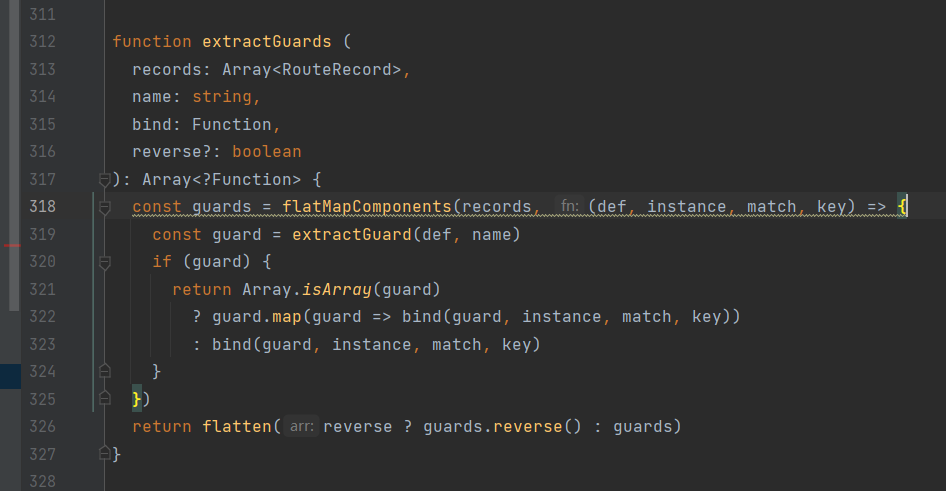

​		这个函数就是创建 guards，获取**flatMapComponents** 返回的数据。然后再调用**flatten** 作为返回值。

​		**flatMapComponents** 方法就是将每个matched里面的数组元素进行传递给 **flatten** 

其中，是从m.componets 里面获取key，然后循环，拿出 自己的 组件，实例，和m，key。然后传递给fn 进行调用，然后将返回值作为一个数组，然后循环了matched的length那么多次，最后返回给了 **flatten** 进行了合并。

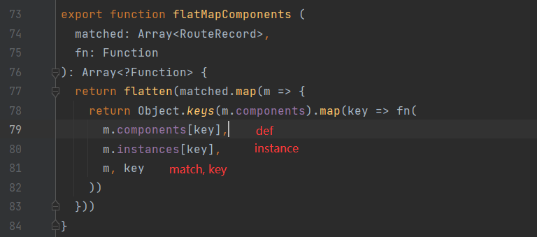 

​		**flatten** 合并数组，扁平化处理。

这个是 route.matched 的路由数组

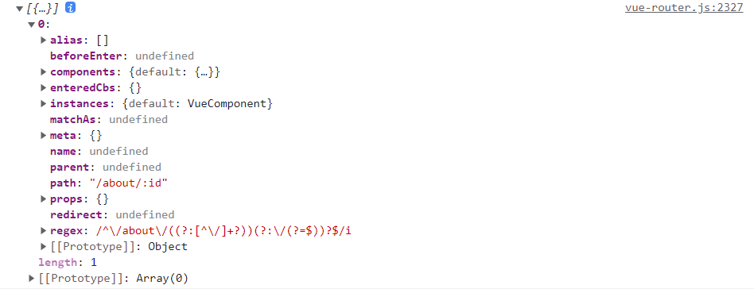

这里传递的参数是，先 matched.map(m => {})，先取出匹配上的路由。进行循环。然后将路由里面的 m.components 就是获取路由里面的components，默认就是一个 default，然后就是map循环路由里面的components。然后取出components。instances，路由本身。key（就是组件名字。）

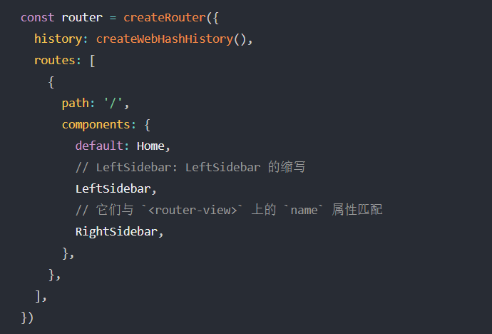


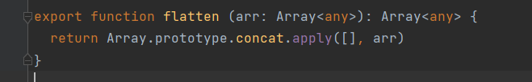

```
[1, 2], [2, 3] => [1, 2, 2, 3]
```

**flatMapComponents** 的fn是传递的方法

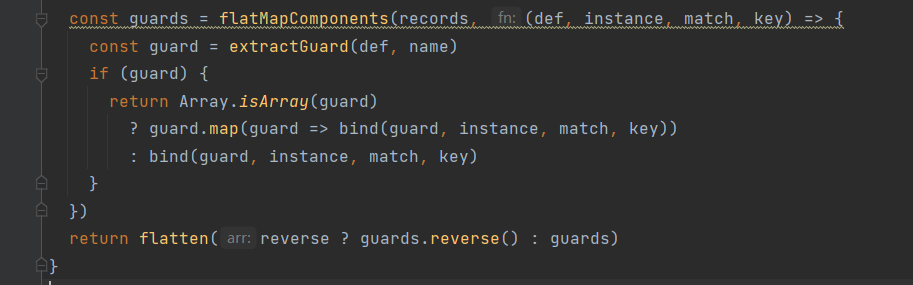

​		**guard**：就是调用这个 extractGuard 的返回值，参数分别为 def：m.components[key] 和 name beforeRouteEnter。

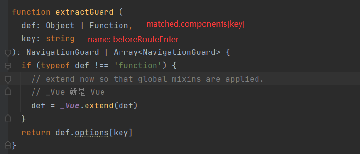

​		这个方法，先判断 def 是不是一个函数。然后对于不是函数的，调用 Vue.extend 方法。这个方法通过查看 API 可以知道是。

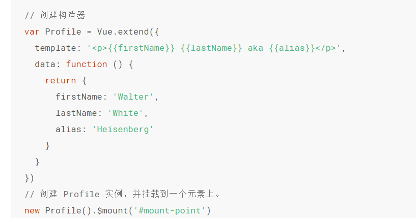

​		简单来看，就像是，先将def进行了extend，然后拿出里面的 options 的 beforeRouteEnter 参数。就是说从组件里面取出beforeRouteEnter方法。

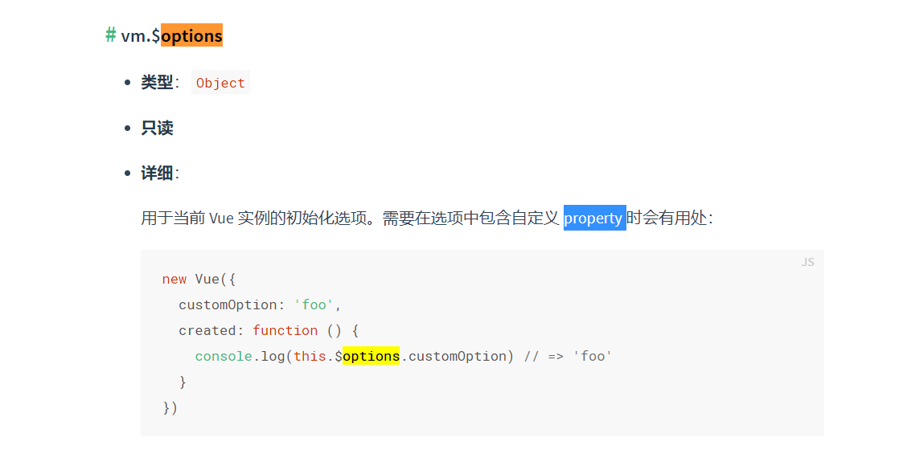

​		所以，知道了 guard 是返回一个 自己定义的 **beforeRouteEnter** 方法。同时 **Vue.extend(def).options['beforeRouteEnter']** 返回的是一个数组（这里我认为应该是Vue的处理，方便混入或者其他情况的解决。但是对于源码我还没有了解。所以不怎么清楚）。


​		然后继续进入 **flatMapComponents** 查看 322 行。进行bind方法的调用（bind 函数是**extractGuards** 传递过来的一个方法）。

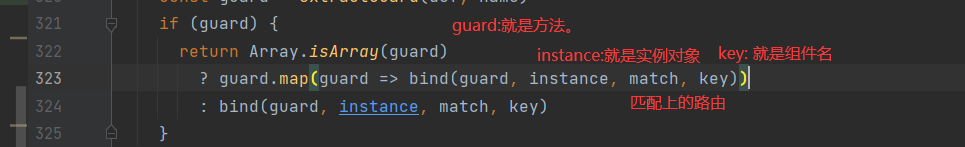

​		通过查看 extractEnterGuards 可以发现，这个会调用bind，然后return 一个 bindEnterGuard。

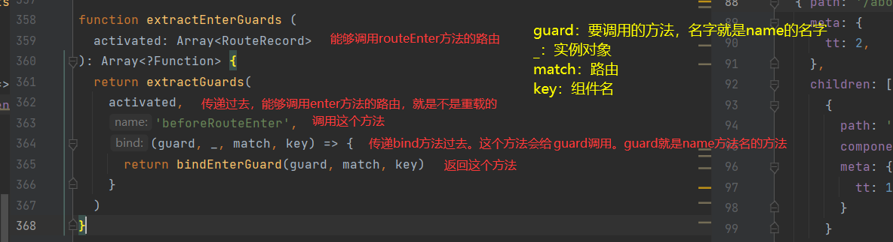

​		我们可以查看 bindEnterGuard 方法。来查看里面的跳转情况。

​		这个方法就是返回一个 routeEnterGuard 方法。然后在方法里面会返回一个guard的调用的返回值。这里guard 就是对应的 **beforeRouteEnter** 方法。

​		通过这个方法我们可以知道，**routeEnterGuard** 里面 guard 是我们自定的 **beforeRouteEnter** 方法。里面的参数中，第三个参数的箭头函数，就是代表了我们的 **beforeRouteEnter** 方法中的 next。同时我们如果输出next也可以发现是正确的。

​		所以我们在 beforeRouteEnter 里面调用next() ，其实就是调用这个方法。然后如果我们传递了参数，那么我们就会进行里面的操作。

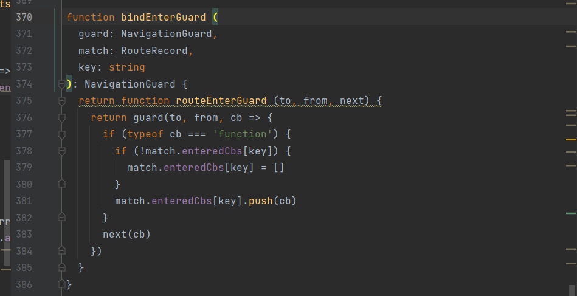

​		同时我们发现，如果我们不调用next方法。这个 guard方法是不会调用的。
