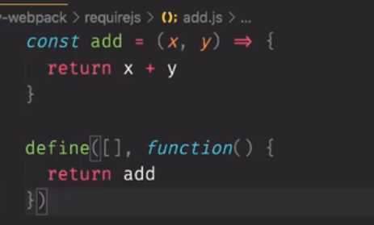
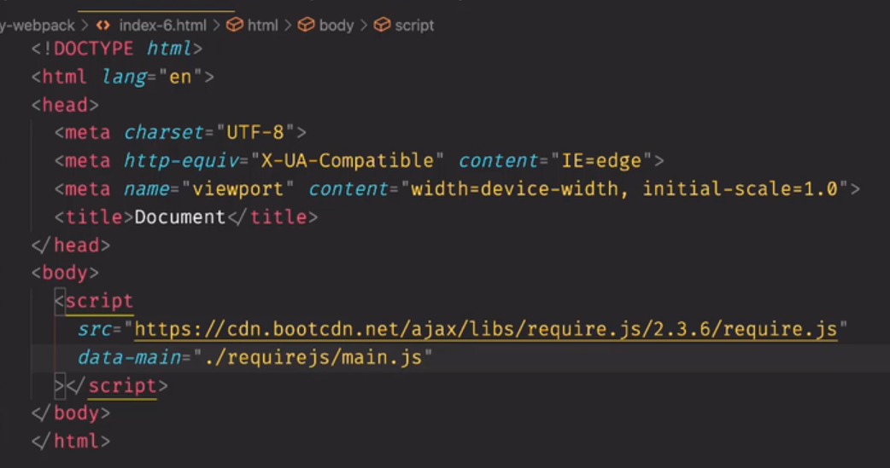
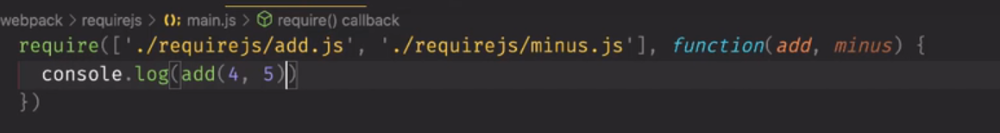

#  webpack 学习

## 模块化

​		首先，对于模块化，我们可以知道的一个是 node.js 作为一个后端的一个JavaScript，可以使用 require。但是这个不能在浏览器上面进行使用。


​		此时我们可以使用一个requireJs的一个方法来进行一个实现。可以在浏览器上面进行调用

```
大致就是 
第一个是需要调用其他js文件的位置，是一个数组，代表了可以传递很多。 ./requireJs/add.js 。。
第二个是一个回调函数，回调函数的参数是从你的 引入的 文件里面那个回调函数的执行的返回值作为的一个参数。同时参数的顺序取决于第一个数组的顺序。
define([], function() {
	return callFn
})
```




定义一个 data-main的位置，代表了需要从哪进行执行。



最后进行执行调用。



这里的 data-* 是html5 的一个新的语法。同时图片懒加载也是运用了这个语法来存储图片的真正的src路径。


​		使用 script 的 type，设置type为module，然后使用 import进行导入

```
import add from './esm/add.js'
```

​		同时，如果使用 file 的方法去浏览器进行访问。那么及那个不能进行获取其他文件的内容。因为此时这个产生了跨域的请求。需要创建一个 http-server。

​		可以使用 npx http-server 进行启动


