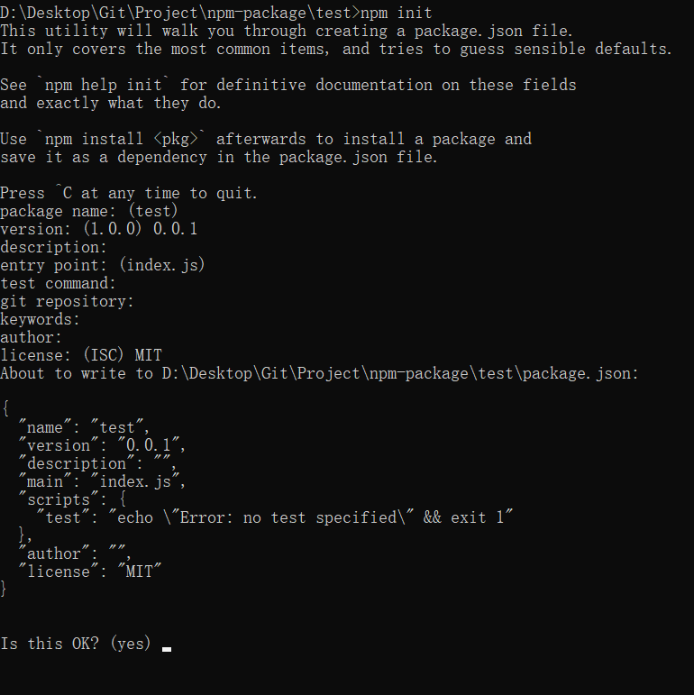

#  npm包上传到npm官网

众所周知，我们可以使用npm i xxx进行下载，npm作为一个包管理的一个工具，我们可以使用别人的包，我们也可以自己在npm上面创建一个属于自己的包，然后使用npm进行下载


## 首先，肯定是要在 npm 官网上面创建一个账号了

```
https://www.npmjs.com/
```


## 然后就是 进入 cmd在本地进行登录

```
使用 npm login 就可以进行登录
```

注意点：

​	这个需要在官网，所以你要知道你现在连接的仓库是

```
https://registry.npmjs.org/
```

​	当然我记得现在比较新的npm应该是在登录的时候可以看到自己登录的网站是哪个，

​	如果看不到自己的网站是哪个，那么我们可以使用一个包管理工具 nrm 进行管理

```
npm i -g nrm

nrm ls
nrm use npm
```

然后使用

```
npm login

输入自己的用户名和密码，然后输入邮箱
```


## 初始化一个包

```
npm init

对应的意思是
包名
版本，听说需要从 0.0.1 开始
描述
入口文件
测试指令：应该是，这个没有用过
git 仓库
关键字，可以用于搜索
作者
证书，用MIT，开源管理不会过于严格，不会引起应激反应
然后就是回车回车完事儿
```




## 编写自己的包的过程

xxxx


然后包编写完了，就是开始上传了

## 最后，上传

这个很简单，就是publish就完了。

```
npm publish
```


## 更新 npm

```
就是修改一下 version
然后 npm publish 就行
```

