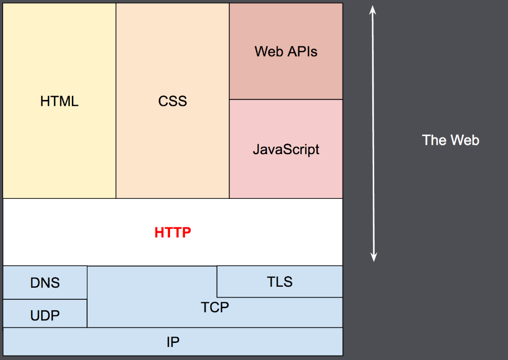
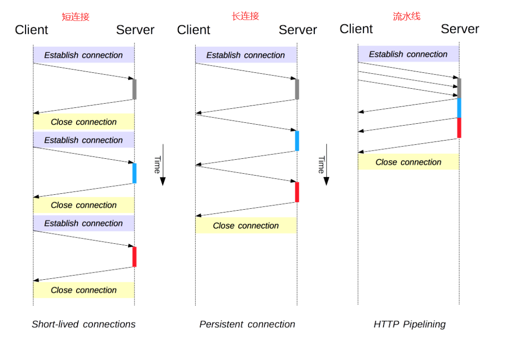

#  HTTP概述

## 概述

找不到说啥，直接放个MDN文档

```
https://developer.mozilla.org/zh-CN/docs/Web/HTTP/Overview
```




## 版本迭代

```
https://developer.mozilla.org/zh-CN/docs/Web/HTTP/Basics_of_HTTP/Evolution_of_HTTP
```

### HTTP/0.9

也被称为 **单行协议** 

请求由单行指令构成，以唯一可用方法[`GET`](https://developer.mozilla.org/zh-CN/docs/Web/HTTP/Methods/GET)开头，其后跟目标资源的路径

```
GET /mypage.html
```

响应就只包含了响应文档本身，就是HTML文件

并且因为不包含响应头，所以只有HTML文件可以进行传输。


### HTTP/1.0

```
最大的变化是支持了传输其他文件，默认是短连接，支持GET、POST、 HEAD请求
```

- 协议版本信息现在会随着每个请求发送（`HTTP/1.0`被追加到了`GET`行）。
- **状态码会在响应开始时发送**，使浏览器能了解请求执行成功或失败，并相应调整行为（如更新或使用本地缓存）。
- 引入了HTTP头的概念，无论是对于请求还是响应，允许传输元数据，使协议变得非常灵活，更具扩展性。
- 在新HTTP头的帮助下，具备了传输除纯文本HTML文件以外其他类型文档的能力（感谢[`Content-Type`](https://developer.mozilla.org/zh-CN/docs/Web/HTTP/Headers/Content-Type)头）。

**默认是短连接，一次请求会建立一次TCP连接，请求结束就断开。**可以通过一个 `Connection: keep-alive`字段使服务器不关闭连接。服务器同时也会响应这个字段。

```
GET /mypage.html HTTP/1.0
User-Agent: NCSA_Mosaic/2.0 (Windows 3.1)

```


### HTTP/1.1

```
最大的变化就是支持了持久连接，默认长连接。不同自己声明 `Connection: keep-alive` ，增加了 `HOST` ，增加了请求方式，支持断点续传功能。
```

- 连接可以复用，节省了多次打开TCP连接加载网页文档资源的时间。
- 增加管线化技术，允许在第一个应答被完全发送之前就发送第二个请求，以降低通信延迟。
- 支持响应分块。
- 引入额外的缓存控制机制。
- 引入内容协商机制，包括语言，编码，类型等，并允许客户端和服务器之间约定以最合适的内容进行交换。
- 感谢[`Host`](https://developer.mozilla.org/zh-CN/docs/Web/HTTP/Headers/Host)头，能够使不同域名配置在同一个IP地址的服务器上。

**Host** 请求头指明了请求将要发送到的服务器主机名和端口号。

如果没有包含端口号，会自动使用被请求服务的默认端口（比如HTTPS URL使用443端口，HTTP URL使用80端口）。

所有HTTP/1.1 请求报文中必须包含一个`Host`头字段。对于缺少`Host`头或者含有超过一个`Host`头的HTTP/1.1 请求，可能会收到[`400`](https://developer.mozilla.org/zh-CN/docs/Web/HTTP/Status/400)（Bad Request）状态码。


所有请求都是通过一个连接实现的。就是持久连接。服务器发现对方一段时间没有活动，就可以主动关闭连接。不过，规范的做法是，客户端在最后一个请求时，发送`Connection: close`，明确要求服务器关闭TCP连接。

```
GET /en-US/docs/Glossary/Simple_header HTTP/1.1
Host: developer.mozilla.org
User-Agent: Mozilla/5.0 (Macintosh; Intel Mac OS X 10.9; rv:50.0) Gecko/20100101 Firefox/50.0
Accept: text/html,application/xhtml+xml,application/xml;q=0.9,*/*;q=0.8
Accept-Language: en-US,en;q=0.5
Accept-Encoding: gzip, deflate, br
Referer: https://developer.mozilla.org/en-US/docs/Glossary/Simple_header

```


### HTTP/2.0

```
最大的区别，协议为二进制协议，服务器主动推送，以及 headers 压缩
```

- HTTP/2是二进制协议而不是文本协议。不再可读，也不可无障碍的手动创建，改善的优化技术现在可被实施。
- 这是一个复用协议。并行的请求能在同一个链接中处理，移除了HTTP/1.x中顺序和阻塞的约束。
- 压缩了headers。因为headers在一系列请求中常常是相似的，其移除了重复和传输重复数据的成本。
- 其允许服务器在客户端缓存中填充数据，通过一个叫服务器推送的机制来提前请求。


### 服务器推送方式

```
http://www.ruanyifeng.com/blog/2017/05/server-sent_events.html
```

**WebSockets**

```
https://developer.mozilla.org/zh-CN/docs/Web/API/WebSockets_API
```

**Server-sent events**

```
https://developer.mozilla.org/zh-CN/docs/Web/API/Server-sent_events
```


## 连接管理

HTTP/1.x有三个，HTTP/2新增了其他的连接管理模型

```
https://developer.mozilla.org/zh-CN/docs/Web/HTTP/Connection_management_in_HTTP_1.x
```


HTTP/1.x的三个连接

短连接，长连接，流水线




### 短连接

​		每一个 HTTP 请求都由它自己独立的连接完成；这意味着发起每一个 HTTP 请求之前都会有一次 TCP 握手，而且是连续不断的。

​		简单来说就是每次请求都要建立连接，请求结束关闭连接，造成了大量的连接时间的浪费。

​		这是 HTTP/1.0 的默认模型(如果没有指定 [`Connection`](https://developer.mozilla.org/zh-CN/docs/Web/HTTP/Headers/Connection) 协议头，或者是值被设置为 `close`)。而在 HTTP/1.1 中，只有当 [`Connection`](https://developer.mozilla.org/zh-CN/docs/Web/HTTP/Headers/Connection) 被设置为 `close` 时才会用到这个模型。


### 长连接

​		在HTTP/1.1被设计出来之前：`Connection: keep-alive`被作为一个请求头，做成了长连接的效果。

​		为了缓解这些问题，*长连接* 的概念便被设计出来了，甚至在 HTTP/1.1 之前。或者这被称之为一个 *keep-alive* 连接。


### 流水线

```
HTTP 流水线在现代浏览器中并不是默认被启用的：
	Web 开发者并不能轻易的遇见和判断那些搞怪的代理服务器的各种莫名其妙的行为。
	正确的实现流水线是复杂的：传输中的资源大小，多少有效的 RTT 会被用到，还有有效带宽，流水线带来的改善有多大的影响范围。不知道这些的话，重要的消息可能被延迟到不重要的消息后面。这个重要性的概念甚至会演变为影响到页面布局！因此 HTTP 流水线在大多数情况下带来的改善并不明显。
	流水线受制于 HOL 问题。
由于这些原因，流水线已经被更好的算法给代替，如 multiplexing，已经用在 HTTP/2。
```

简单理解就是说，直接发送连续的请求，不需要等待每次的响应。


### 域名分片

简单的理解就是为域名多建立几个连接。以实现并发请求。但是HTTP/2支持客户端的并发请求