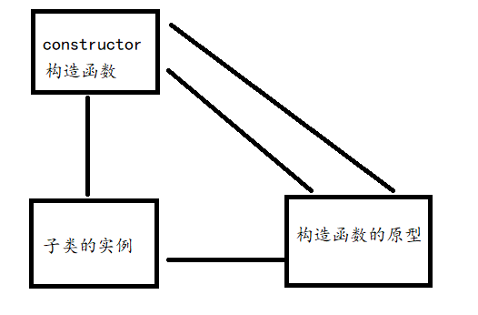
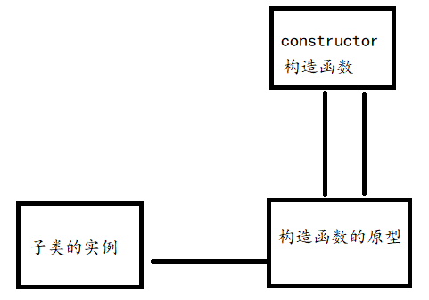

 **注意：**

**这里的内容为本人的理解，不敢保正。**


#  JavaScript原型链

先看一张图，简单来说

​		原型其实就是一个方法的实例，然后每一个方法的实例有一个\_\_proto\_\_ 的指向。这个指向会直到指到null为止。这样所生产的就是一个原型链，对于在本层找不到的方法，会通过原型链逐层向上查找。

​		一个方法是和一个原型对应的，而一个原型又是一个另一个方法的实例，所以这里的对应关系在于，一个方法的实例默认是没有constructor构造函数，此时这个实例就是一个单纯的底层实例，但是如果我们将一个构造函数的原型指向了这个实例，并且将这个实例的构造器指向了原型， 那么这个实例就已经算是一个原型了，此时就已经不是一个单纯的底层实例了。

​		顶层的方法就是 Function，顶层的原型就是Object.prototype，而Object方法确实使用了Function的原型。


# JavaScript 继承


```
function Fn() {
  this.name = 1;
}

let a = new Fn();

此时的
a.__proto__ = Fn.prototype
a.__proto__.constructor = Fn;
```

## new 方法的行为

​		我们要这样思考，这个new方法。

* new 一个方法，会创建的一个this的指向。
* 然后会执行这个方法，执行结束之后。
* 创建一个 \_\_proto\_\_  指向了 方法的 prototype 的指向。
* 然后就进行返回。

```
let _this = {};
let result = Fn.apply(_this, args);
_this.__proto__ = Fn.prototype;
return typeof result === 'object' ? result : __this__;
```

​		同时这里，在进行 new 方法的调用时，我们知道，如果返回的是一个引用类型，那么便会直接返回这个引用类型，如果返回的是一个值类型，那么返回的便是自己所创建的this指向。我们可以知道一个引用类型，无论你是使用的new方法，还是直接进行的创建的引用类型。其结果都会创建原型。

**注意**：

​		对于一个值类型，进行了new 方法，也会变成引用类型的。

```
let x = new Number(1);
let y = new Number(1);

console.log(x === y); //false
```


## **JavaScript 继承**：

### 继承的思路

继承，简单的理解就是，子类的实例可以访问父类的方法

同时我们可以知道，父类的方法，创建的实例才能进行调用。

而父类的prototype，已经可以算作为父类的父类的方法了。

所以，我们在不考虑上级的方法之前，需要将父类的方法进行传递，

这里，可以考虑使用一个新的对象进行指定。如果我一个新对象


### 原型和构造器

这里和Java的一个不同点

我印象中，Java是子类有多个，父类越来越少的一种情况，



​		一开始，我是这样思考的，构造函数和实例是对应的，而构造函数的原型应该是属于上层的一个实例了。

​		但是你仔细观察，发现，一个构造函数的原型是和构造函数进行了对应。思想应该是每个实例都有一个原型，但是其原型默认是没有constructor的（这里可以使用 hasOwnProperty 进行证明）。我们所使用的constructor属性其实都是我们的实例的原型  \_\_proto\_\_ 中的constructor，但是实例的原型为什么会带有constructor，这里我的认为是，一个函数默认在词法编译阶段，会默认指向一个prototype，而这个行为就是 

```
Fn.protorype = new Object();
Fn.prototype.constructor = Fn;
```

​	简单来说，就是在没有指定的情况下，默认先创建一个顶级的对象实例，里面只有最原始的方法，然后再对这个实例创建一个本函数的构造行为。



​		而这个JavaScript是每个子类，都会将父类进行一次实例的操作，所以造成了每个父类的实例和子类的构造函数一一对应了。


### new 方法实现

#### **`new` 关键字会进行如下的操作：**

1. 创建一个空的简单JavaScript对象（即`{}`）；
2. 为步骤1新创建的对象添加属性**__proto__**，将该属性链接至构造函数的原型对象 ；
3. 将步骤1新创建的对象作为`this`的上下文 ；
4. 如果该函数没有返回对象，则返回`this`。

#### **当代码 `new Foo(...)` 执行时，会发生以下事情：**

1. 一个继承自 `Foo.prototype` 的新对象被创建。
2. 使用指定的参数调用构造函数 *`Foo`*，并将 `this` 绑定到新创建的对象。`new Foo` 等同于 *`new Foo`*`()`，也就是没有指定参数列表，*`Foo`* 不带任何参数调用的情况。
3. 由构造函数返回的对象就是 `new` 表达式的结果。如果构造函数没有显式返回一个对象，则使用步骤1创建的对象。（一般情况下，构造函数不返回值，但是用户可以选择主动返回对象，来覆盖正常的对象创建步骤）

```
function create(Fn, ...args) {
  let _this = {};
  let result = Fn.apply(_this, args);
  _this.__proto__ = Fn.prototype;
  return typeof result === 'object' ? result : _this;
}
```


### 继承的方式

#### 原型链继承

```
Children.prototype = new Father();
Children.prototype.constructor = Children;
```

​		很简单的理解，就是直接将子类的原型修改为了父类的实例，然后再对实例的constructor进行一个校准，修改为子类的构造。

​		执行new方法的行为的步骤：

* 产生一个this指向，\_\_proto\_\_  的添加，指向为children.prototype。就是 Father的实例。
* 执行children的构造函数，this指向的调用。
* 返回。


**缺点**：

* 对于要在原型上添加修改的方法，需要在 new Father 之后，因为这个是直接将一个地址进行了转换。
* 其次就是不会将参数传递到父类。只适合不带参数的。
* 因为实例是在直接对原型的创建，所以，所有的实例都是共有的。当然，因为这个创建本就无法带参数，共有实例其实并没有什么问题。


#### 组合继承

```
function Children() {
	Father.call(this);
}
Children.prototype = new Father();
Children.prototype.constructor = Children;
```

​		这个和原型链继承大同小异，就是多了一个在构造函数内部使用call方法调用父类。使用call方法调用时是不会产生 \_\_proto\_\_  和 constructor 的。但是你可能会发现自己测试还是有啊，但是你仔细观察，其实你自己测试所生成的 \_\_proto\_\_  和 constructor 是在创建对象的时候生成的。所以，其实并没有真正的生成。


**缺点**：

* new 方法 和 call 方法都生成了一份实例。


#### 寄生组合继承

```
function Children() {
	Father.call(this);
}
(function () {
	let Super = function() {};
	Super.prototype = Father.prototype;
	Children.prototype = new Super();
	Children.prototype.constructor = Children;
})();
```

​		我们可以查看这个和 组合继承的区别，使用了一个空方法将Father的原型复制了过来，所以new所生成的方法就只生成了一个空对象，和一个原型。Father的方法实则已经在call方法里面进行了调用。


##### 寄生组合继承的思考

为什么我们会这样使用寄生组合继承

我们可以从各个方面进行思考，

首先继承无非就是子类想要使用上父类的元素，然后这里就需要调用父类的方法

```
function Children() {
	
}
Children.prototype = new Father();

这个方法的问题是无法传参。
这里修改了原型指向，所以需要进行构造函数的指向转变
Children.prototype.constructor = Children;
```

```
function Children() {
	let instance = new Father(xxx);
	
	return instance;
}

这个方法是可以传递参数了，但是这个方法就不是父类的实例了，因为是在子类被创建，所以我们要不就是对子类也同用这个instance对象进行操作。但是这样有点不符合一种规范
这里是使用了instance方式，而instance实则是父类的实例，所以如果需要进行子类实例的操作。需要在new Fahter的后面，然后将this转换成instance，然后对于proto和构造 函数都是父函数的。很有问题的感觉
```

```
function Children() {
	Father.call(this);
}

在这里，我是将父元素的方法进行了执行，当然，如果是对于父元素返回的是一个对象的，那么将会是一个不同的操作，但是在正常的情况下，通过这个可以获取到父元素的构造函数执行方法，但是，问题在于没有原型指向的改变。所以我们需要进行原型指向的改变。
简单来说，这里已经获取到了父函数的实例对象，只需要将原型指向进行改变即可
Children.prototype = new Father();
Children.prototype.constructor = Children;
通过上面这个方法，我们获取到了原型的指向，修改为了父元素的实例。唯一的问题就是进行了两次Father的使用，可以考虑对于父函数的实例进行一个处理

let Super = funtion() {};
Super.prototype = Father.prototype;
Children.prototype = new Super();
Children.prototype.constructor = Children;
区别，new的是Super，Super里面没有实例，所以里面只有一个原型的指向。
而Super的原型的指向已经被修改为了Father的原型。
此时我们只需要在对构造函数进行一个修改即可。
```


所以最后我们使用了寄生组合继承，方式就是在内部使用call方法调用了父函数，获取了父函数的实例方法，然后在外部创建一个空函数，原型指向了父函数的原型，然后再对其实例赋值给了子类的原型，此时因为空函数的实例内部是没有的，所以其实内部的共有属性就只有proto，和 constructor。然后在修改原型的构造。

​		所以整的来说，这个方式，只生成了相同的父类的实例的方法，并且放在了子类的实例中，所以不会出现共有属性，其次就是原型是在外部进行的实现，所以原型又是共有的。其次就是对原型的构造函数进行了指向。

​		所以很完美。