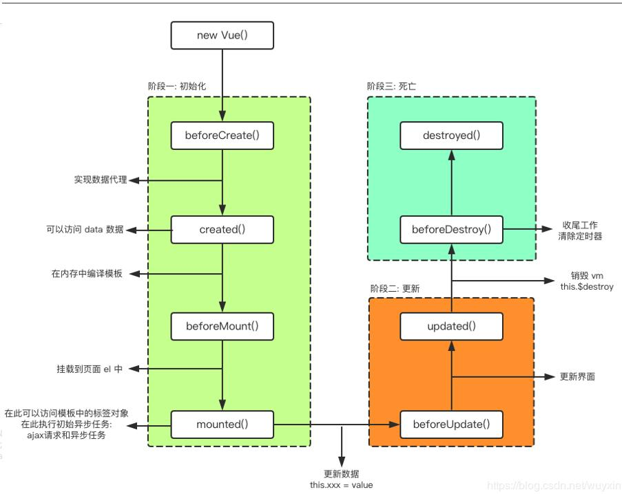

# Vue生命周期

先来一个直译的形式

```
  创建一个Vue实例 new Vue
  初始化事件和生命周期
  调用 beforeCreate钩子
  初始化注入和反应
  调用 created 钩子
  编译模板阶段
		Has el option 这里是判断是否使用了 el这个属性。如果没有使用那么就是属于未挂载的状态，只有在之后 $mount 被调用时才会进行下一步的编译。
		Has template option，判断是否使用了template参数。如果没有使用template参数，那么就将用el元素时的内部标签，如果使用了template元素，那么就会将template的字符串作为标签覆盖el元素内部的，除非有插槽。
		这里的 outerHTML，我们也知道就是：除了包含innerHTML的全部内容外, 还包含对象标签本身。
	然后就是调用 beforeMount 钩子
	然后就是创建 虚拟DOM 并且替换 el，这里就是实现了将页面的显示。此时这里在显示的时候就已经创建好了虚拟DOM并且还进行了数据和视图的绑定。
	调用 mounted 钩子，但是记住，这里这个钩子并不会保正所有的子组件都被挂载完成，虽然大部分情况都是的。当然可以使用 nexttick 这个函数来保证了所有的组件被渲染。
	现在已经装载完成，处于组件在视图中的情况。此时当数据发生改变会引起 beforeupdate钩子
	beforeUpdate钩子函数，在数据发生改变的时候，进行虚拟dom的渲染和patch之前。
	updated钩子函数，在渲染和patch之后。但是不会保证所有的子组件都刷新。
	当调用了 destroy方法，触发了 beforeDestroy钩子
	拆卸 watchers，子组件和事件监听
	已经被销毁了，调用destroyed
```


简单就是分为了三大阶段。

**初始化，数据响应式，销毁。**




# 分析每一阶段

## beforeCreate

​		实例初始化之后，进行数据监听和事件/侦听器的配置之前

​		此时实例已经初始化了，就是有了this的指向，但是还没有开启数据监听和事件的配置。

​		但是没有data属性

## created

​		此时代表已经创建完成，已经将data对象创建好了，那么也代表了已经创建了响应的准备。

​		但是还没有开始编译模板。

## beforeMount

​		此时是创建了虚拟DOM进行了存储，对于存在了el参数的将会即时编译，不存在el参数的将会等待被调用时(vm.$mount(el))，再进行编译。

​		在编译完成之后便会调用beforeMount，此时就是处于编译完成，但是却没有进行页面渲染。

​		在挂载开始之前被调用：相关的 `render` 函数首次被调用。

​		此时我们可以发现，虽然我们使用 this.$el 会有输出，但是里面的 括号表达式还没有被转换为data的数据。{{ message }}

​		就是属于创建了一个虚拟的节点但是还没有进行处理。


## mounted

​		el 被新创建的 $el 替换了。此时模板已经渲染到了浏览器，

​		但是注意并不会保证所有的子组件也已经被挂载完成。


## beforeUpdate

​		此时是数据已经发生了改变，但是还没有更新DOM时被调用。

​		这里我们可以了解以下Vue的一个更新形式，在被修改了DOM时，是先进行虚拟DOM的修改，然后直到一个执行的结束，然后再进行渲染。这里的一个是指的是一个任务的执行结束加上微任务的结束。而宏任务会被记录为下一个nexttick

​		我们也可以简单的使用代码进行测试

```
new Promise(((resolve, reject) => {
  this.a = 10;
  resolve(20);
})).then(res => {
  this.a = res;
})
setTimeout(() => {
  this.a = 30;
}, 0);

先使用promise，promise内部是一个同步，直到一个异步的开始，便下一个。
then方法会被加入微任务
settimeout方法会被加入宏任务。
所以最后使用
beforeUpdate() {
	// console.log(this.a);
  this.$nextTick(() => {
    console.log(this.a);
  });
}
输出时，nexttick会等待一个任务加上微任务的结束为标识进行执行。所以先直接输出两次 20
然后再输出一次 30
这里为什么会输出两次20，原因是beforeUpdate执行了两次，所以就运行了两次。
```


## updated

​		此时，组件的DOM已经更新。可以使用一些依赖DOM的操作，但是不会保证子组件的渲染完成。


## beforeDestroy

​		在实例被销毁之前被调用，此时所有的实例任然完全可以使用。


## destroyed

​		实例销毁之后调用，此时所有的实例已经被解绑，监听已经被移除。所有的子实例也被销毁。