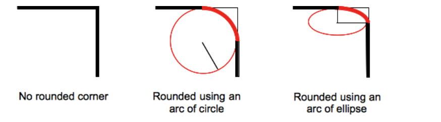
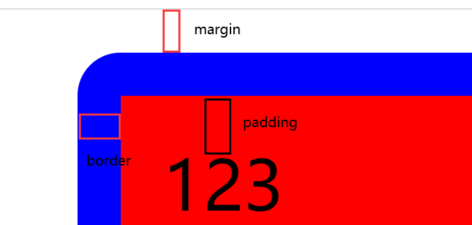
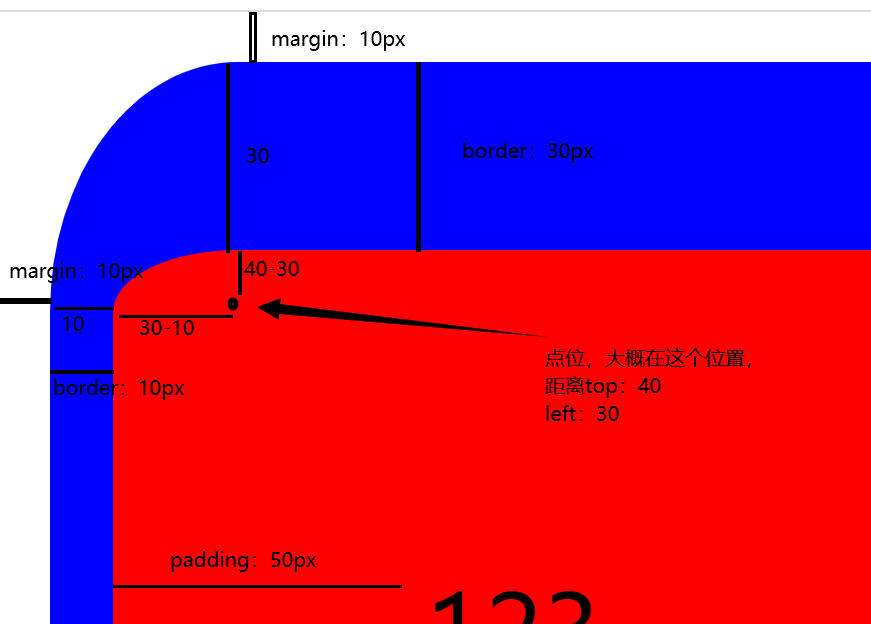

#  border-radius的原理和使用

```
https://developer.mozilla.org/zh-CN/docs/Web/CSS/border-radius
```


## 原理：

首先我们可以知道 `border-radius` 是四个属性的简写，所以我们先理解四个属性的值的效果。

`border-top-right-radius` `border-top-left-radius`

 `border-bottom-right-radius` `border-bottm-left-radius`

我们取其中一个

`border-top-right-radius`

```
https://developer.mozilla.org/zh-CN/docs/Web/CSS/border-top-right-radius
```

```
	border-top-right-radius属性设置元素的右上角弧形，这个圆弧可能是一个椭圆，或者其中一个值是0的话，就是没有圆弧，换句话就是说拐角是方形的。
```



通过图片我们可以知道 `border-top-right-radius` 的值是一个据 top 和 right 的一个半径，然后画弧所裁剪出来的值。

```
border-top-right-radius: radius               
/* the corner is a circle    */  E.g. border-top-right-radius: 3px
border-top-right-radius: horizontal vertical  
/* the corner is an ellipsis */  E.g. border-top-right-radius: 0.5em 1em
```

通过例子也可以知道，对于一个值，说明了 横轴`horizontal` 和 数轴`vertical` 的值相等，对于两个值，那么就说明了第一值是横轴，第二个值是数轴。

然后得到横轴和数轴的半径后，相对进行偏移，然后画出一个圆形或者一个椭圆形，所裁剪出来的值。就是得到的效果。

对于值是%的，那么宽度就会相对于宽度，高度就会相对于高度。


### 对于超过 50% 的计算方式

原文链接

```
https://zhuanlan.zhihu.com/p/20128284
```

简单来说就是对于 **相邻的角的半径和超过了对应的盒子的边的长度，那么浏览器要重新计算保证它们不会重合。**

就是会同时进行缩放。来保证不会重合。


## 水平和垂直从哪个位置开始偏移

### 我们先看使用px的计算

先说结果，结果是，**px的计算是相对于border的位置开始的偏移。**

然后我们再看代码和执行结果

```
<!DOCTYPE html>
<html lang="zh">
<head>
  <meta charset="UTF-8">
  <title>Title</title>
  <style>
    .d {
      width: 100px;
      height: 100px;
      background-color: #f00;
      border: blue solid 10px;
      padding: 10px;
      margin: 10px;
      border-radius: 10px;
    }
  </style>
</head>
<body>
<div class="d">123</div>
</body>
</html>
```




### 我们再看使用 百分号% 进行的计算

意思是一样的，会按照你的宽高加上你的border的宽高，然后乘以 百分比。

```
开始我这样写，以为10%应该是 50px，但是忘了border有上有下，所以真正的宽高是550px，所以50%是55px，后面才搞清楚

width: 450px;
height: 450px;
background-color: #f00;
border: blue solid 50px;
border-radius: 10%;
```


## 如何裁剪

这个就是自己的理解了，我们可以看到，对于存在了border的，当你的数值超过了一定值之后，你的content也会变成弧边，而这个值就是border的宽度。

**所以这个裁剪的方法是：**

- 先计算出radius的偏移量x，y

- 然后从border的边框开始进行x，y的偏移，并且半径值也为x，y画弧，将border进行了裁剪。
- 然后如果x，y的偏移量在content里面了（这个content是包含了padding的），那么就会再对content进行裁剪，而裁剪的半径就是x，y这个点到content边界的半径。

示例：

```
<!DOCTYPE html>
<html lang="zh">
<head>
  <meta charset="UTF-8">
  <title>Title</title>
  <style>
    * {
      padding: 0;
      margin: 0;
    }
    .d {
      width: 450px;
      height: 450px;
      background-color: #f00;
      border: blue solid 25px;
      border-top: blue solid 30px;
      border-left: blue solid 10px;
      padding: 50px;
      margin: 10px;
      border-top-left-radius: 30px 40px;
    }
  </style>
</head>
<body>
<div class="d">123</div>
</body>
</html>
```

结果：




## 简写参数

```
	border-radius: top-left top-right bottom-right bottom-left;
	上左，上右，下右，下左，这是一个从上左开始的一个顺时针顺序。
	按此顺序设置每个 radii 的四个值。如果省略 bottom-left，则与 top-right 相同。如果省略 bottom-right，则与 top-left 相同。如果省略 top-right，则与 top-left 相同。
		参考链接：(https://www.w3school.com.cn/cssref/pr_border-radius.asp)
	意思就是，如果在省略的情况下，那么就是最后一个开始是没有值的，而前面的才有值，然后对没有值的那个，他的值就是对面的值，如果对面也没有值，那么他的值就和旁边的相等(此时就是只有一个参数)
	
	按照上面的意思来理解的话，那么很多简写参数都可以理解了。我这里就直接统计结果。
```


### 第一步，将参数从简写的个数化为完整个数

#### 一个参数 `border-radius: 50px;`

```
border-radius: 50px;

只有一个 top-left 
那么，bottom-right = top-left = 50
并且 bottom-left = top-right = top-left = 50

border-radius: 50px 50px 50px 50px;
```


#### 两个参数 `border-radius: 50px 30px;`

```
border-radius: 50px 30px;

有两个，那么这两个就是 top-left 和 top-right
对应的 bottom-left = top-right = 30
bottom-right = top-left = 50

border-radius: 50px 30px 50px 30px;
```


#### 三个参数 `border-radius: 50px 30px 40px;`

```
border-radius: 50px 30px 40px;

有三个，那么就只有最后一个 bottom-left 没有
那么 bottom-left 等于对面的 top-right = 30px

border-radius: 50px 30px 40px 30px;
```


#### 四个参数 `border-radius: 50px 40px 30px 20px;`

```
border-radius: 50px 40px 30px 20px;

没啥说的。
```


#### 对于参数里面带有 `/` 符号的 `border-radius: 4px 3px 6px / 2px 4px;`

```
border-radius: 4px 3px 6px / 2px 4px;

这个分为两个部分
第一部分 4 3 6 将其转化为对应的 horizontal
	所以为 4 3 6 3
第二部分 2 4 将其转化为对应的 vertical
	所以为 2 4 2 4
	
border-radius: 4px 3px 6px 3px / 2px 4px 2px 4px;
	
然后结果就是
border-top-left-radius:     4px 2px;
border-top-right-radius:    3px 4px;
border-bottom-right-radius: 6px 2px;
border-bottom-left-radius:  3px 4px;
```


### 第二步，将其转化为 `border-*-*-radius`

#### 对于没有带 `/` 符号的 `border-radius: 50px 40px 30px 20px;`

```
其 horizontal 和 vertical 的值相等。

border-radius: 50px 40px 30px 20px;

border-top-left-radius:     50px 50px;
border-top-right-radius:    40px 40px;
border-bottom-right-radius: 30px 30px;
border-bottom-left-radius:  20px 20px;
```


#### 对于带有 `/` 符号的 `border-radius: 4px 3px 6px 3px / 2px 4px 2px 4px;`

```
会将 / 前的作为每一个的 horizontal 
/ 后的作为每一个的 vertical

border-radius: 4px 3px 6px 3px / 2px 4px 2px 4px;

border-top-left-radius:     4px 2px;
border-top-right-radius:    3px 4px;
border-bottom-right-radius: 6px 2px;
border-bottom-left-radius:  3px 4px;
```


