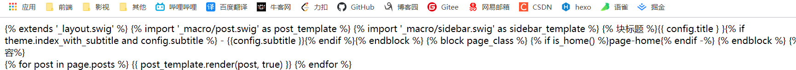
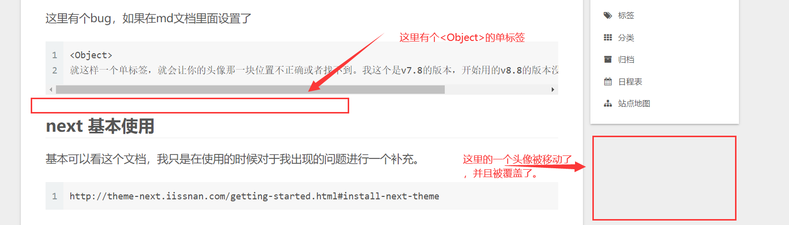
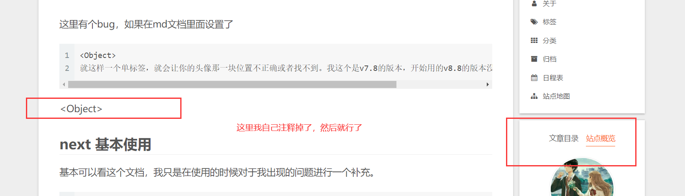

# next 基本使用

基本可以看这个文档，我只是在使用的时候对于我出现的问题进行一个补充。

```
http://theme-next.iissnan.com/getting-started.html#install-next-theme
```

下面这个是比较新的情况，有一个组织进行了维护。使用也有说明

```
https://theme-next.js.org/docs/getting-started/
```


```
如果
hexo d 的命令不行，
可以尝试在前面加上 npx
npx hexo d
```

npx 主要作用就是让项目内部模块用起来更加方便，具体可以看

```
http://www.ruanyifeng.com/blog/2019/02/npx.html
```


## 启用主题

这里可能会因为新的版本的原因网页不能显示，这里我去百度了。




原因是hexo在5.0之后把swig给删除了需要自己手动安装，所以只需要安装一下 这个就行了。

```java
 npm i hexo-renderer-swig
```


对于v7.8，其他版本的我没有尝试，不知道这个问题，这里有个bug，如果在md文档里面设置了

```
<Object>
就这样一个单标签，就会让你的头像那一块位置不正确或者找不到。我这个是v7.8的版本，开始用的v8.8的版本没有问题，这个原因应该是因为没有对md文档里面的内容的处理。
```






## 设置 菜单

这里设置 的 菜单出现错误，这个应该是v5这个版本之前的bug，后面的应该都解决了

因为 在那个 /about/||user，这个 `||`之前不能有空格，空格会被当作url，你也可以看到点击之后的url地址后面有个%20,这个就是空格。

不过较新的版本解决了这个问题。具体是从哪个版本开始解决的不清楚。

```
menu:
  home: /|| home
  about: /about/|| user
  tags: /tags/|| tags
  categories: /categories/|| th
  archives: /archives/|| archive
  schedule: /schedule/|| calendar
  sitemap: /sitemap.xml|| sitemap
  #commonweal: /404/|| heartbeat
```


## 设置头像

相对地址和url都放在url后面

```
avatar:
  # Replace the default image and set the url here.
  url: /uploads/avatar.jpg #/images/avatar.gif
```


## 黑暗模式

我这里不对，没有效果。

```
darkmode: true
```


# 后续主题配置

```
http://theme-next.iissnan.com/theme-settings.html#tags-page
```


## 字体设置，代码高亮

```
https://theme-next.js.org/highlight/
```


## 图标

```
social:
  GitHub: https://github.com/tallgy || fab fa-github
  Gitee: https://gitee.com/tallgy || fab fa-github-alt
  #E-Mail: mailto:yourname@gmail.com || fa fa-envelope
  #Weibo: https://weibo.com/yourname || fab fa-weibo
```

图标网址

```
https://fontawesome.dashgame.com/
```

```
选中自己想要的图标，然后他后面有一个复制的按钮，直接复制，替换掉就行了。
```


# 三方服务集成

```
http://theme-next.iissnan.com/third-party-services.html
```


## 评论系统

**DISQUS**，大部分都是需要翻墙的，所以我就没有搞。。。

```

```

