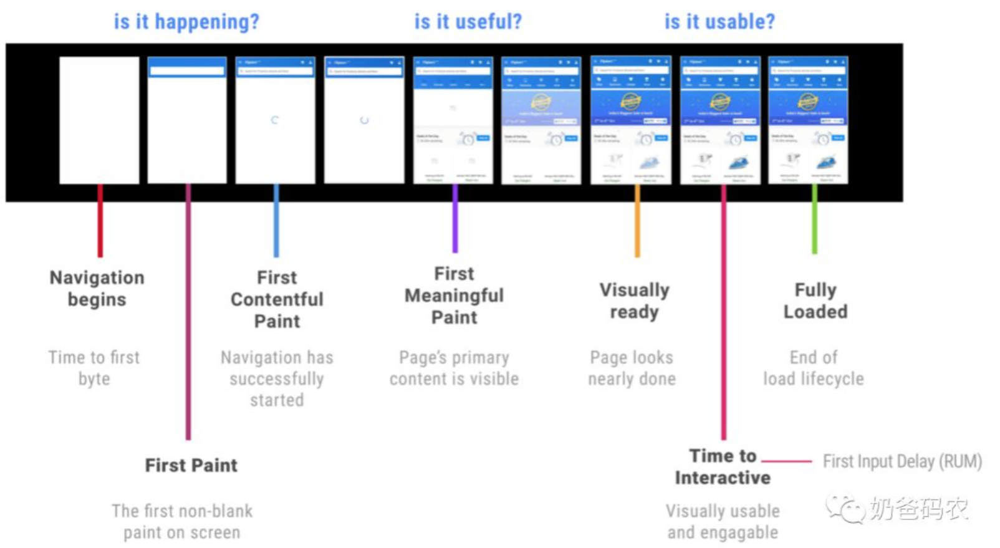

# 前言

随着前端项目的发展，从一个前后端的耦合，变成了 前后端的分离
然后 前端变成的一个 SPA 项目。
然后随着用户体验的提升，要提升用户响应速度。

随着前端系统的越发复杂，前端的性能也受到越来越多的重视。Google也不断在推进新的性能相关指标，从原先的Performance API中的指标逐步演进成用户性能体验相关的指标。
对于用户而言，First Paint、First Meaningful Paint和TTI这几个指标可以直接影响到用户体验。

## CSR Client Side Rendering 客户端渲染

所有的页面渲染、逻辑处理、页面路由、接口请求均是在浏览器中发生

就是在 vue react 中开始的渲染方式， SPA 应用，因为开启了 前后端分离，同时将页面的渲染放在了前端

但是由于和服务端会有多次交互（获取静态资源、获取数据），同时依赖浏览器进行渲染，在移动设备尤其是低配设备上，首屏时间和完全可交互时间是比较长的。

## SSR Server Side Rendering 服务端渲染

在服务端完成页面模板、数据填充、页面渲染，然后将完整的HTML内容返回给到浏览器。由于所有的渲染工作都在服务端完成，因此网站的首屏时间和TTI都会表现比较好。
但是 SSR 对于 复杂页面交互有一些不好。
同时 SSR 就类似于以前那种，由后端响应后拼接好所需要展示的数据，然后再进行返回。

## NSR Native Side Rendering

这个还不是很了解
UC浏览器在新闻feed流页面加载中采用了NSR（Native Side Rendering），首先在列表页中加载离线页面模板，通过Ajax预加载页面数据，通过Native渲染生成Html数据并且缓存在客户端。

## ESR Edge Side Rendering 边缘流式渲染方案

简单来说，就是 静态 html 放在cdn，然后返回，然后请求的数据异步请求，再渲染出来。

## SSG static site generator 静态页面渲染

## ISR Incremental Static Regeneration - 增量静态再生

ISR 目前使用的不多，它算是 SSG 的一种增强版，指的是在 SSG 的基础上，服务端在收到页面请求时会对页面的时效性进行判断，如果认定失效则会对该页面进行增量构建的一种模式。

可以看出 ISR 在构建和客户端环节没有任何的变化，而是增加了 Server 端的逻辑：

* 在服务端收到对应页面请求时服务端会先返回当前内容然后对页面做失效验证
* 如果页面实现，服务端会对失效的页面进行后台增量构建

当下次请求到达时如果新的页面已经生成成功则会返回新页面的内容，但在此之前还会继续使用旧页面的内容
当然上述的逻辑并不绝对，先增量构建再返回也同样是 ISR，只是一般这样会影响到用户体验一般不推荐。

**ISR 适用的场景是：**
* 网站匹配 SSG 场景
* 但对页面有一定的实时性要求

比如说天气预报页面，可能半小时更新一次即可，或者是新闻页面，在存在新数据时再进行增量构建也是一种解决方案。

# 引用

https://juejin.cn/post/6844904178519834638?searchId=20230811152803DD6CF02C61F9A1B03F22#heading-1