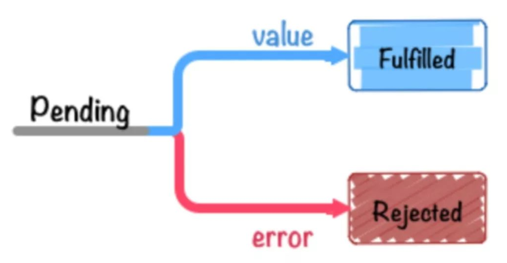

# Promise

## 为什么需要 Promise
作用：
Promise 的主要特点是解决异步问题。
解决回调地狱，让代码更具有可读性


那么为什么需要。按照传统的异步的回调的实现
在不考虑 async await 因为 async await 的实现本身也是依赖了 Promise

```JavaScript
const asyncFn = () => {
  // ... 一些异步操作
}
const mainFn = () => {
  // 这里调用了异步，然后就会继续往下执行,那么我们怎么才能获取到值呢。
  asyncFn();
}
```

通过上面可以知道，我们没有办法拿到数据，因为是异步的原因
所以此时我们使用的方法是使用回调.
但是此时就会出现一个问题，如果，我们下一个异步请求依赖了上一个
我们就需要在回调里面写这个异步，同理
所以此时就会出现嵌套的回调地狱的情况
```JavaScript
const asyncFn = (callback) => {
  // ... 一些异步操作
  // 在异步内执行完了之后，调用这个回调
  callback();
}

const mainFn = () => {
  const callback = (val) => {
    log(val)
  }
  asyncFn(callback);
}
```

## Promise 介绍

首先 Promise 分为三个状态 pending fulfilled rejected
最开始是 pending 态，然后转为 fulfilled 和 rejected 之后就不能进行转换了




**简单使用**

```JavaScript

const myPromise = new Promise((resolve, reject) => {
  setTimeout(() => {
    resolve("foo");
  }, 300);
});

myPromise
  .then(handleFulfilledA, handleRejectedA)
  .then(handleFulfilledB, handleRejectedB)
  .then(handleFulfilledC, handleRejectedC);

```

then 方法的链式调用，和如何在 then 方法里面使用 Promise
```JavaScript

const myPromise = new Promise((resolve, reject) => {
  setTimeout(() => {
    resolve("foo");
  }, 300);
});

myPromise.then(resolve => {
  console.log(1, resolve);
  return myPromise
}, reject => {
  console.log(2);
}).then(resolve => {
  console.log(3, resolve);
  return 3;
}, reject => {
  console.log(4);
}).then(resolve => {
  console.log(5, resolve);
}, reject => {
  console.log(6);
}).catch(_ => {
  console.log(7);
})

/*
1 foo
3 foo
5 3
*/
```


then 方法的调用，同时上次 Promise 的 reject 不影响下次的 then
```JavaScript
const myPromise = new Promise((resolve, reject) => {
  setTimeout(() => {
    reject("foo");
  }, 300);
});

myPromise.then(resolve => {
  console.log(1, resolve);
  return myPromise
}, reject => {
  console.log(2);
}).then(resolve => {
  console.log(3, resolve);
  return 3;
}, reject => {
  console.log(4);
}).catch(_ => {
  console.log(7);
})

/*
2
3 undefined
*/

```


then 方法报错触发 reject
```JavaScript
const myPromise = new Promise((resolve, reject) => {
  setTimeout(() => {
    reject("foo");
  }, 300);
});

myPromise.then(() => {}, reject => {
  console.log('reject1', reject);
  asdf
  return Promise.reject(1);
}).then(() => {}, reject => {
  console.log('reject2', reject);
}).catch(_ => {
  console.log('catch', _);
})

/*
reject1 foo
reject2 ReferenceError: asdf is not defined        
    at D:\Documents\GitRepositories\information\tes
t.js:9:3
*/
```


catch 方法被调用的情况
* reject 同时没有 then 去获取
* 方法抛错 (同时 then 的 reject 方法也会去获取到这个错误)
```JavaScript
const myPromise = new Promise((resolve, reject) => {
  setTimeout(() => {
    reject("foo");
  }, 300);
});

myPromise.then(() => {}, reject => {
  console.log('reject1', reject);
  asdf
  return Promise.reject(1);
}).catch(_ => {
  console.log('catch', _);
})

/*
reject1 foo
catch ReferenceError: asdf is not defined
    at D:\Documents\GitRepositories\information\tes
t.js:9:3
*/
```


## Promise API


### Promise.all()

在所有传入的 Promise 都被兑现时兑现；在任意一个 Promise 被拒绝时拒绝。
如果全部兑现了则返回一个包含所有被兑现的值，
如果存在拒绝，返回第一个被拒绝的原因，这里的第一个是 reject 的第一个，不是所有reject里面在数组靠前的第一个

基础使用
```JavaScript
const p1 = Promise.resolve(3);
const p2 = 1337;
const p3 = new Promise((resolve, reject) => {
  setTimeout(() => {
    resolve("foo");
  }, 100);
});

Promise.all([p1, p2, p3]).then((values) => {
  console.log(values); // [3, 1337, "foo"]
});
```

带有 reject 且 异步性
```JavaScript
const mixedPromisesArray = [Promise.resolve(33), Promise.reject(44)];
const p = Promise.all(mixedPromisesArray);
console.log(p);
setTimeout(() => {
  console.log("队列现在为空");
  console.log(p);
});

// Logs:
// Promise { <state>: "pending" }
// 队列现在为空
// Promise { <state>: "rejected", <reason>: 44 }
```

all 方法的执行逻辑
发现针对的异步问题， 222 执行了 111 执行了 但是 333 没有执行
说明了，首先 all 方法是都会执行 同步部分 ，直到遇到 rejected 
注意： 这里有问题，因为是没有在 then 方法里面加 reject 去获取。。
```JavaScript

Promise.all([
  Promise.resolve(33),
  new Promise((resolve, reject) => setTimeout(() => {
    console.log(' 11111111  -------------');
    reject(66)
  }, 0)),
  new Promise((resolve) => {
    console.log('22222222  -------------');
    setTimeout(() => {
      console.log('333333333  -------------');
      resolve(66)
    }, 0)
  }),
  99,
]).then((values) => console.log(values));

/*
22222222  -------------
11111111  -------------
error 66
*/
```

如果 then 方法有了 reject就不会报错
```JavaScript
Promise.all([
  Promise.resolve(33),
  new Promise((resolve, reject) => setTimeout(() => {
    console.log(' 11111111  -------------');
    reject(66)
  }, 0)),
  new Promise((resolve) => {
    console.log('22222222  -------------');
    setTimeout(() => {
      console.log('333333333  -------------');
      resolve(66)
    }, 0)
  }),
  99,
]).then((values) => console.log(values), (reject) => {
  console.log('reject', reject);
});

/*
22222222  -------------
 11111111  -------------
reject 66
333333333  -------------
*/
```

### Promise.allSettled()

在所有的 Promise 都被敲定时兑现。
只会 resolve 没有 reject。但是 resolve 里面存在 status 来判断是否是 成功的

和 all 的区别：
* allSettled 方法返回的是一个对象，里面有 status 和 value
* 只会 resolve 不会 reject 。
```JavaScript
Promise.allSettled([
  Promise.resolve(33),
  new Promise((resolve) => setTimeout(() => resolve(66), 0)),
  99,
  Promise.reject(new Error("一个错误")),
]).then((values) => console.log(values));
// [
//   { status: 'fulfilled', value: 33 },
//   { status: 'fulfilled', value: 66 },
//   { status: 'fulfilled', value: 99 },
//   { status: 'rejected', reason: Error: 一个错误 }
// ]
```


### Promise.any()

在任意一个 Promise 被兑现时兑现；仅在所有的 Promise 都被拒绝时才会拒绝。
resolve 第一个被兑现的值


### Promise.prototype.catch()


### Promise.prototype.finally()


### Promise.race()

在任意一个 Promise 被敲定时敲定。换句话说，在任意一个 Promise 被兑现时兑现；在任意一个的 Promise 被拒绝时拒绝。
resolve 或者 reject 第一个返回的值。

### Promise.reject()


### Promise.resolve()


### Promise.prototype.then()


