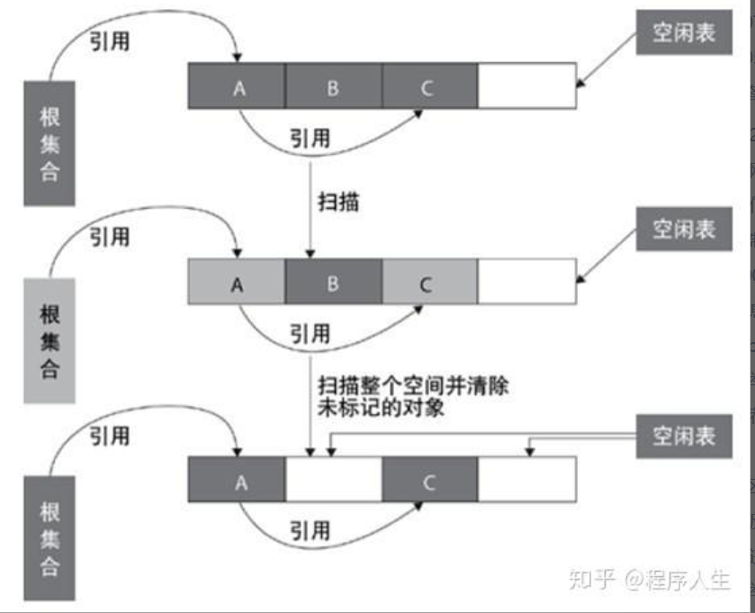

# 垃圾回收机制

## 什么是垃圾回收

简单来说，因为程序的内存使用是有上限的，所以如果我们一直在用，但是不释放内存，那么内存只会越来越大，到后面就会出现没有内存，导致内存泄露的问题。

## 垃圾回收机制

### 自动回收

JavaScript、Java、Go、Python、PHP、Ruby、C#

### 手动回收

C、C++、Rust

## 垃圾回收运行机制

### 栈内存和堆内存

为什么 JavaScript 会分开为两个内存进行管理，基本类型使用栈，引用类型使用堆。
因为是为了方便函数调用栈的切换，因为基本类型所花销的内存小，而引用类型所花销的内存大。
所以如果栈空间大了的话，所有数据存放在栈空间中，会影响到上下文切换的效率，从而影响整个程序的执行效率，所以占内存大的数据会放在堆空间中，引用它的地址来表示这个变量。

## 垃圾回收机制有哪些

### 引用计数法

引用计数法实现简单，效率较高，在大部分情况下是一个不错的算法。

原理：
  给对象添加一个引用计数器，每当有一个地方引用该对象时，计数器加1，当引用失效时，计数器减1，当计数器值为0时表示该对象不再被使用。

需要注意的是：
  引用计数法很难解决对象之间相互循环引用的问题，主流Java虚拟机没有选用引用计数法来管理内存。

### 标记-清除算法（Mark-Sweep）

  标记-清除算法分为两个阶段：标记阶段和清除阶段。标记阶段的任务是标记出所有需要被回收的对象，清除阶段就是回收被标记的对象所占用的空间。具体过程如下图所示：

有一个比较严重的问题就是容易产生内存碎片，碎片太多可能会导致后续过程中需要为大对象分配空间时无法找到足够的空间而提前触发新的一次垃圾收集动作。
标记-清除算法采用从根集合（GC Roots）进行扫描，对存活的对象进行标记，标记完毕后，再扫描整个空间中未被标记的对象，进行回收，如下图所示。标记-清除算法不需要进行对象的移动，只需对不存活的对象进行处理，在存活对象比较多的情况下极为高效，但由于标记-清除算法直接回收不存活的对象，因此会造成内存碎片。

### 复制算法(Copying)

为了解决Mark-Sweep算法的缺陷，Copying算法就被提了出来。它将可用内存按容量划分为大小相等的两块，每次只使用其中的一块。当这一块的内存用完了，就将还存活着的对象复制到另外一块上面，然后再把已使用的内存空间一次清理掉，这样一来就不容易出现内存碎片的问题。

这种算法虽然实现简单，运行高效且不容易产生内存碎片，但是却对内存空间的使用做出了高昂的代价，因为能够使用的内存缩减到原来的一半。

### 标记-整理算法(Mark-compact)

为了解决Copying算法的缺陷，充分利用内存空间，提出了Mark-Compact算法。该算法标记阶段和Mark-Sweep一样，但是在完成标记之后，它不是直接清理可回收对象，而是将存活对象都向一端移动(美团面试题目，记住是完成标记之后，先不清理，先移动再清理回收对象)，然后清理掉端边界以外的内存(美团问过)

标记-整理算法采用标记-清除算法一样的方式进行对象的标记，但在清除时不同，在回收不存活的对象占用的空间后，会将所有的存活对象往左端空闲空间移动，并更新对应的指针。

标记-整理算法是在标记-清除算法的基础上，又进行了对象的移动

### 分代收集算法 Generational Collection（分代收集）算法

分代收集算法是目前大部分JVM的垃圾收集器采用的算法。

它的核心思想是根据对象存活的生命周期将内存划分为若干个不同的区域。一般情况下将堆区划分为老年代（Tenured Generation）和新生代（Young Generation），在堆区之外还有一个代就是永久代（Permanet Generation）。
老年代的特点是每次垃圾收集时只有少量对象需要被回收，而新生代的特点是每次垃圾回收时都有大量的对象需要被回收，那么就可以根据不同代的特点采取最适合的收集算法。

#### 新生代

目前大部分垃圾收集器对于新生代都采取 (复制) Copying 算法，因为新生代中每次垃圾回收都要回收大部分对象，也就是说需要复制的操作次数较少，但是实际中并不是按照1：1的比例来划分新生代的空间的，一般来说是将新生代划分为一块较大的Eden空间和两块较小的Survivor空间（一般为8:1:1），每次使用Eden空间和其中的一块Survivor空间，当进行回收时，将Eden和Survivor中还存活的对象复制到另一块Survivor空间中，然后清理掉Eden和刚才使用过的Survivor空间。

#### 老年代

老年代的特点是每次回收都只回收少量对象，一般使用的是Mark-Compact算法。

#### 新生代和老年代的区别(阿里面试官的题目)： 
**所谓的新生代和老年代是针对于分代收集算法来定义的，新生代又分为Eden和Survivor两个区。加上老年代就这三个区。数据会首先分配到Eden区 当中（当然也有特殊情况，如果是大对象那么会直接放入到老年代（大对象是指需要大量连续内存空间的java对象）。），当Eden没有足够空间的时候就会 触发jvm发起一次Minor GC。如果对象经过一次Minor GC还存活，并且又能被Survivor空间接受，那么将被移动到Survivor空 间当中。并将其年龄设为1，对象在Survivor每熬过一次Minor GC，年龄就加1，当年龄达到一定的程度（默认为15）时，就会被晋升到老年代 中了，当然晋升老年代的年龄是可以设置的。如果老年代满了就执行：Full GC 因为不经常执行，因此采用了 Mark-Compact算法清理。其实新生代和老年代就是针对于对象做分区存储，更便于回收等等。

#### 持久代（Permanent Generation）(也就是方法区)的回收算法

## JavaScript 使用的 分代收集算法 Generational Collection（分代收集）算法

分代收集的大致逻辑是一样的，所以这里直接引用一篇文章来进行描述
引用
https://zhuanlan.zhihu.com/p/576722965

# 引用

https://www.zhihu.com/question/32373436/answer/1368674757