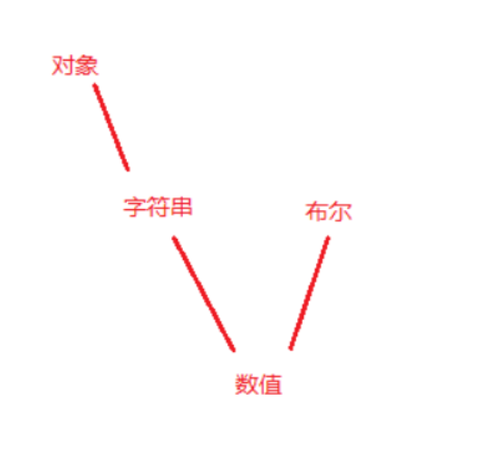

#  JavaScript类型转换

参考的文章

```
https://www.cnblogs.com/shikaka/p/10463293.html
https://www.cnblogs.com/shikaka/p/10473462.html
```


## 基本数据类型

```
string， number， Boolean， null， undefined， symbol
```

基本数据类型是没有方法可以调用的。

但是我们却发现，

```
'aaa'.indexOf('a');
```

这个明明是基本数据类型，但是却可以调用方法，这个是为什么呢。

这个是因为`JavaScript`在底层进行了一个操作，当发现调用方法的是一个基本数据类型的话，会根据这个类型来创建一个对应的引用数据类型对象。然后再调用这个方法，调用之后将返回值进行返回并将这个对象进行删除。


在 `JavaScript` 中，类型转换主要的两个方法是

`valueOf` ， `toString`

我们下面分别对这两个进行一个判断使用操作。


```
let a = 1,
    b = 'a',
    c = true,
    d = undefined,
    e = null,
    f = [1, 2, 3],
    g = ['1', '3'],
    h = new Number(3),
    i = new String('12'),
    j = new Boolean(false),
    k = new Object({ a: 3} ),
    l = { b: 4 },
    m = function () {},
    n = new Date(),
    o = new RegExp('sss'),
    p = /sss/,
    q = `sdcard`,
    r = new Array([1,2,3]);
```


## valueOf

```
console.log(a.valueOf());
console.log(b.valueOf());
console.log(c.valueOf());
// console.log(d.valueOf());
// console.log(e.valueOf());
console.log(f.valueOf());
console.log(h.valueOf());
console.log(i.valueOf());
console.log(j.valueOf());
console.log(k.valueOf());
console.log(n.valueOf());
console.log(o.valueOf());
```

#### 这就是执行的结果。

```
1
a
true
[ 1, 2, 3 ]
3
12
false
{ a: 3 }
1634610286344
/sss/
```

#### 我们可以从结果里面看到

| 类型                                         | 结果                                                     |
| -------------------------------------------- | -------------------------------------------------------- |
| null，undefined                              | 没有valueOf方法，会报错                                  |
| 基本数据类型，包括Symbol类型                 | valueOf方法为其本身，可以使用 === 来判断，Symbol为true。 |
| 对象，数组，方法，正则                       | 也为其本身                                               |
| 使用new方法创建的基本数据类型，new number(1) | 为其值，与原来不等。                                     |
| date类型                                     | 当前时间距 1970.01.01 午夜的毫秒数                       |


所以我们可以看到，

基本除了对象，其他的类型使用valueOf方法都可以转换成基本数据类型。

对于使用new方法创建的基本数据类型的引用数据类型，也会被转换成基本数据类型。

这里的原因，是因为 `number `对象对 `valueOf` 进行了一次重写，所以在调用的时候就会调用自己所重写的方法，于是返回的结果会不同。其他也同理。

但是`JavaScript`内部是如何进行操作，取出值的，我还是不了解。


## toString

```
console.log(a.toString());
console.log(b.toString());
console.log(c.toString());
// console.log(d.toString());
// console.log(e.toString());
console.log(f.toString());
console.log(h.toString());
console.log(i.toString());
console.log(j.toString());
console.log(k.toString());
console.log(n.toString());
console.log(o.toString());
```

```
1
a
true
1,2,3
3
12
false
[object Object]
Tue Oct 19 2021 10:50:07 GMT+0800 (中国标准时间)
/sss/
```


| 类型             | 结果                           |
| ---------------- | ------------------------------ |
| null， undefined | 没有toString方法               |
| 基本数据类型     | 直接转为字符串                 |
| 普通对象         | 直接转为字符串 [object Object] |
| 日期，正则对象   | 转为对应值的字符串             |


# 隐式类型转换


我这里主要讲解一下隐式类型转换

### 对于一个对象转为基本数据类型的方法

对于一个不是基本数据类型的。会先通过 `valueOf` 转换，看是否能转为基本数据类型

如果还不可以，然后就会使用 `toString `方法转为字符串。然后再来进行判断。

对于 `Date` 对象的话，使用顺序会反过来


### 转字符串。

就直接toString方法就行了。


### 转数字

就类似于 `Number(undefined); ` 的情况

```
null， false		-> 0
undefined		-> NaN
```

#### 对于字符串

```
字符串含有字符的。没有特殊含义的都为 NaN

'1.111111111111111e+50' 这个就会转为数字，还有进制表示和小数点会转，其他带有字符会被转成 NaN
```

#### 对于对象

```
先使用前面我说过的规则转为基本类型，然后再进行转换。
```


### 转布尔值

几个特殊值为 `false`

```
NaN, undefined， null， 0， +0， -0， ''
```

其他为true


## 基本上涉及运算和比较就会出现隐式类型转换


### 加号 + 

存在字符串则转为字符串的拼接操作

非字符串就会转数字操作。

```
console.log(1+2+'')
1+2 先为3，
然后3+'' 为3
```

这个就涉及到了上面的转换规则


这里有个小问题

```
let x = Symbol(1);
console.log(x + '1')
这样会抛出异常，虽然Symbol可以使用toString，
但是不能进行隐式转换。
```


### 减号 - 乘号 * 除号 /

会转为数字进行运算。

```
特殊的，对于 NaN运算得NaN
对于 0/0 等于 NaN
对于 1/0 等于 Infinity
```


|| 和 && 这里这个返回值不是`true`和`false`而是返回两边操作数的执行结果。


### 比较运算

**转换规则**




#### == 和 ===

非严格相等等号 可以允许强制类型转换，

而严格相等等号 不允许强制类型的转换。


其他的就如上，使用上面的转换规则进行转换。


这里有个小问题点

```
if ([]) {
  console.log(1)
} else {
  console.log(2)
}
此时会输出为1，所以说明了[]在if判断里面为真，但是 [] == true 为false，
这里可以看上面 转布尔值 那个地方，说明了，布尔在进行判断时 除了 undefined，null，NaN，0， ''，其他都为true
因此也可以说明，if判断是使用的 Boolean 来进行的判断为真还是为假。而不是与true进行的比较。
```


#### null和undefined的比较

null和undefined进行比较时

​	使用非严格等号为 true

​	使用严格等号为 false

```
null == undefined
```


#### NaN 不与任何值相等，包括自己

```
NaN == NaN	false
```

```
并且 NaN > 0 和 NaN <= 0 都为 false
```


