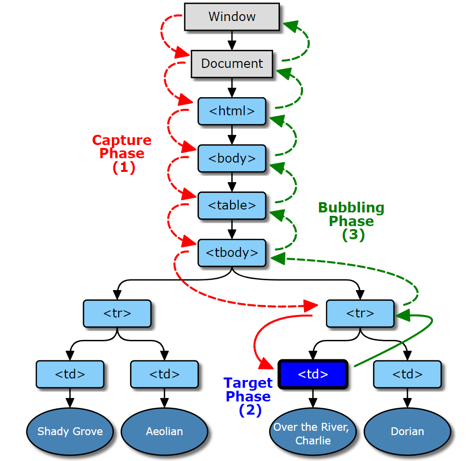

# DOM 事件传递 

三个阶段:
  捕获,目标,冒泡

我们可以通过使用 eventPhase 属性查看当前 event 是属于什么阶段

```JavaScript

// 捕获
const unsigned short	CAPTURING_PHASE = 1;
// 目标
const unsigned short	AT_TARGET = 2;
// 冒泡
const unsigned short	BUBBLING_PHASE = 3;

```

## 简述三个阶段流程

* 首先是从 根节点 出发,到达目标节点, 如果此过程中遇到的事件, 就被称为 捕获事件
* 在节点到达 目标节点 之后, 此时就处于 目标 阶段
* 在目标阶段过后, 最后又会一路往回到达根节点, 此过程中的事件, 被称为 冒泡事件.




**总结**

* 先捕获 再冒泡
* 当事件传递到target时，无捕获冒泡之分
* 如何在定义事件时决定为捕获阶段还是冒泡阶段
  * target.addEventListener(type, listener[, useCapture]);
  * 这里的 第三个参数就是用来定义监听的阶段
  * true 代表捕获, false 代表冒泡.
  * 默认是 false.
* 在**目标事件**这里，不管`addEventListenter`的第三个参数是true还是false，都没有先捕获后冒泡的说法，既这里会**按顺序执行**。


# **JavaScript-DOM的监听方式**

```
dom.addEventListener('click', function (e) {
  console.log('father1 捕获');
}, true);

dom.onclick = function (e) {
  console.log('a2 冒泡');
}
```

在这里,又被称为 **DOM0级** 和 **DOM2级**

## **0级DOM**:

* 标签内部的 onclick 事件
* JavaScript 的 onclick = function() {} 函数

## **2级DOM:**

* 就是标准的事件模型
* **addEventListener** 和 **removeEventListener**


#  JavaScript-冒泡和捕获

参考文章，感觉写的很详细

```
https://blog.csdn.net/sinat_33523805/article/details/94018242
```

​		在一个 `Event` 的事件中，存在三个阶段：`捕获，目标和冒泡`

**三个阶段的顺序：**

* 首先是从根节点出发，到达目标节点，若此过程中触发了事件，则被称为**捕获阶段**

* 然后当节点到达定义点击事件的目标节点时，处于**目标阶段**

* 在目标节点触发事件后，最后就会一路往上回到根节点，处于 **冒泡阶段**

  ​	给一张对应的图片。


​		如何在创建一个点击监听的时候，同时定义是处于冒泡还是捕获阶段。

​		通过一个 `addEventListener` 函数的参数，分别为 **事件名， 回调函数， 在什么阶段执行**。第三个参数就是判断是处于什么阶段的。**true代表捕获阶段，false代表了冒泡阶段**。

​		对于target，顺序不是按照捕获和冒泡的顺序，而是按照监听函数的创建顺序。

​		可以通过 `event.eventPhase` 的值来判断是处于哪个阶段。

​			`1，捕获阶段。2，目标阶段。3，冒泡阶段`

```
  father.addEventListener('click', function (e) {
    console.log('father 捕获');
    console.log(e.eventPhase);	// 1
  }, true);
  father.addEventListener('click', function (e) {
    console.log('father 冒泡');
  }, false);

  children.addEventListener('click', function (e) {
    console.log('children 冒泡');
  }, false);
  children.addEventListener('click', function (e) {
    console.log('children 捕获');
  }, true);
```

```
father 捕获
children 冒泡
children 捕获
father 冒泡
```


**结论：**

* 捕获是从根到target， 冒泡是从target到根。

* 先捕获，后冒泡。
* 可以通过 `addEventListener` 的第三个参数来决定这个监听处于捕获还是处于冒泡。默认是冒泡阶段。
* 对于 `target` 元素，没有捕获冒泡一说，先定义先执行。
* 可以通过 `event.eventPhase` 来判断当前处于什么阶段。


# 取消事件传递

​		通过这三个方式 `stopPropagation()` 、`prenventDefault()`、`return false;`、`stopImmediatePropagation()`。

* `stopPropagation()` 
  * 会停止事件的传递。但是不会阻止事件的默认方法。

* `stopImmediatIePropagation()` 
  * 同上，但是对于多个相同的事件都会被阻止。具体区别一会儿看案例.

* `prenventDefault()` 
  * 取消掉元素的默认行为.

* `return false;` 
  * 会取消默认行为,但是只能用于 DOM0级.
  * 但是不会终止事件的传递.


## stopPropagation 和 stopImmediatIePropagation 的使用

```
children1.addEventListener('click', function (e) {
	console.log('a 捕获');
	e.stopPropagation();
}, true);	//为true,代表了捕获.
  
children1.addEventListener('click', function (e) {
    console.log('a1 捕获');
}, true);	//为true,代表了捕获.

这里对上面进行了 stopPropagation 所以会停止传递,但是
	对于上层元素,传递会直接停止,所以如果是在捕获层进行了使用,那么就会在调用了本层方法后,就会停止, 如果是在冒泡层进行使用,就会结束后续的冒泡行为.
	对于 target 的使用,因为 target 不分冒泡和捕获,所以两个都会执行.
执行结果:	father 捕获, target 捕获, target 冒泡(阻止了事件的继续.虽然这个阻止放在了 捕获 位置, 但是对于 target 是不分 冒泡 和 捕获 的.所以 target 的冒泡也会执行.)
	其中对于 target 的捕获和冒泡的顺序,按照定义的顺序执行.

对于 stopImmediatIePropagation 的使用,大体上和上面起始差不多,最大的区别就是,不但会停止传递,并且会停止本层的相同事件.
比如代码类型:

    children1.addEventListener('click', function (e) {
        console.log('a 捕获');
    	e.stopImmediatePropagation();
    }, true);
    children1.addEventListener('click', function (e) {
        console.log('a1 捕获');
    }, true);
    children1.addEventListener('click', function (e) {
        console.log('a 冒泡');
    }, false);
	
	我这里定义了两个相同的捕获. 但是使用的是 e.stopImmediatePropagation(); 所以,对于相同的事件都会停止,然后因为这个 stopImmediatePropagation 放在了最上面定义的位置,所以放在下面的都不会执行. 如果我把这个函数的位置放在了第二个,那么第一个还是会执行
执行结果:
	father 捕获, target 捕获(阻止了事件的传递. 并且因为target的捕获和冒泡属于同一类型,所以都被阻止了.)
```

**简单总结:**

* **stopPropagation**
  * 对于非target, 会阻止后续的事件, 但是对于相同的事件不会阻止.
  * 对于 target, 因为 target 是**不分冒泡和捕获**,所以只会阻止上级元素的事件,对于 target 的**冒泡** 和 **捕获** 都不会阻止.
* **stopImmediatIePropagation**
  * 这个不但会阻止后续的事件, 对于相同的事件也会阻止.
* **相同点**是: 他们都**不会阻止元素的默认事件的执行,就算是捕获和冒泡没有到target.**


## prenventDefault 使用

**作用:**

​	取消元素的默认行为.如果放在了父元素,那么子元素的所有默认行为都会被取消.

**使用方式:**

```
  children1.addEventListener('click', function (e) {
    console.log('a 捕获');
    e.preventDefault();
  }, true);
  
这个很简单.
```


## return false; 的使用

这个的使用方式不和上面的一样.

```
  children1.onclick = function (e) {
    console.log('a2 冒泡');
    return false;
  }
  
不能在 addEventListener 的回调函数里面使用. 因为这个是通过return 的值为false,来进行的定义,如果要使用 addEventListener 的回调的话, 函数的返回值不能正确返回,但是要怎么实现我也不知道.
```


# 事件委托

​		理解很简单, 就是子元素的点击, 父级也可以进行捕获和冒泡, 很多人说事件委托是利用的冒泡原理, 但是通过前面的学习我们可以知道,事件委托,无非就是 子元素 的点击可以被父元素所监听到. 所以这里肯定会感觉不对, 然后我去网上看了一篇文章,  然后断章取义了一番.

```
https://blog.csdn.net/mmrsdym/article/details/39209375
```

​		我了解到了,为什么事件委托要使用的是冒泡原理, 而不是使用的捕获的原因.

​		大概的意思就是, 一个元素是先进行的捕获行为, 然后再进行的冒泡行为. 所以如果我们将事件委托放在了, 捕获上面. 如果要阻止事件的行为, 那么就会让子元素的所有事件都不能执行, 而放在了事件的冒泡的话, 子元素的一些行为还是可以执行的.  所以这就是为什么事件委托需要放在冒泡的原因. 