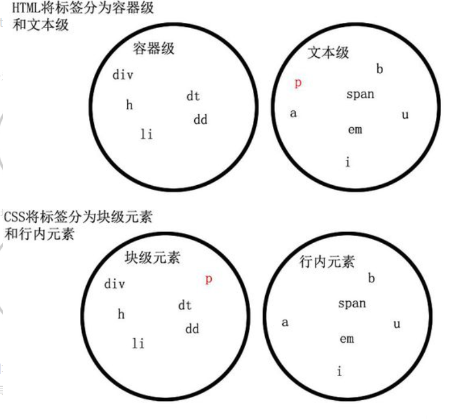

# 块级元素和行内元素


块级元素
div,	h,	li,	p,	dt,	dd

行内元素
a,	b,	span,	em,	i,	u




## 特点

### 行内元素的特点

* 行内元素只能容纳文本或者其他行内元素。
* 宽度只与内容有关。
* 和其他元素都在一行上。
* 高，行高及外边距和内边距部分可改变。


### 块级元素的特点

* 它可以容纳内联元素和其他块元素。
* 宽带始终是与浏览器宽度一样，与内容无关。
* 总是在新行上开始，占据一整行。
* 高度，行高以及外边距和内边距都可控制。


## 区别


* 行内元素会在一条直线上分列，都是统一行的，程度偏向分列。
    * 块级元素各盘踞一行，垂直偏向分列。
    * 块级元素重新行开端停止接着一个断行。

* 行内元素不可以设置宽高，宽度高度随文本内容的变化而变化，但是可以设置行高（line-height），
    * 同时在设置外边距margin上下无效，左右有效，内填充padding上下无效，左右有效；

* 块级元素可以设置宽高，并且宽度高度以及外边距，内填充都可随意控制。

* 块级元素能够包括行内元素和块级元素，还能够包容内联元素和其余元素；
* 行内元素不能够包括块级元素，只能包容文本或许其余行内元素


## 使用CSS转换

```
转换的方式是用css的display属性

display:block;    /*转换为块级*/
display:inline;    /*转换为行内*/

还有一种是
display:inline-block;    /* 其实仍未行内元素，但是可以设置width及height属性等*/
```
