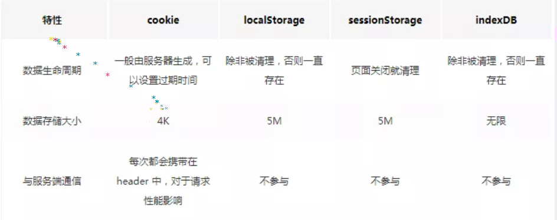

# 浏览器存储

* cookie
* state
* sessionStorage
* localStorage
* indexDB

## cookie

可以设置过期时间
getCookie() 获取的是字符串 ; 号分割

## state

浏览器的 history 属性里面存在 state 属性。
比如在使用 React Router 里面，每个 state 都有
同时在每次 history 的变动都会没有

## sessionStorage

sessionStorage 是一个 键值对的格式
在一个标签会话 属于一层存储
如果标签没有删除就在
但是也有同源问题

## localStorage

大致和 sessionStorage 差不多，但是存储时间一直存在

## indexDB

存储时间一直存在，
同时存储的内存更大。

