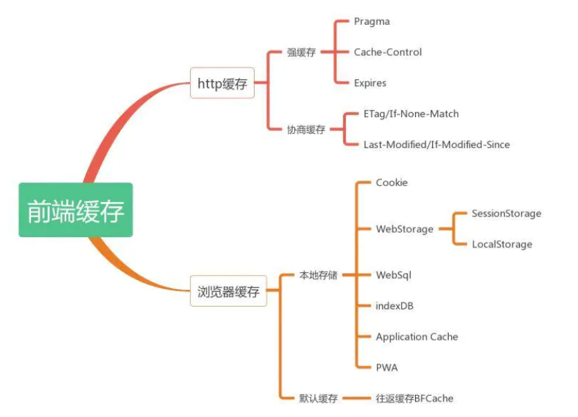
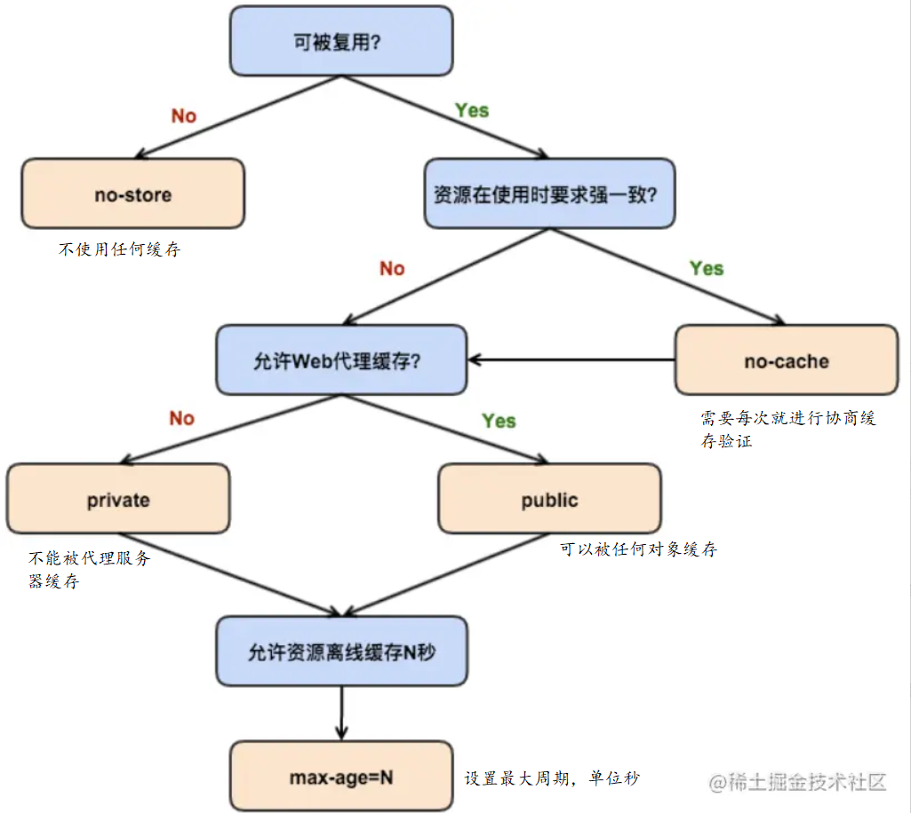

#  浏览器缓存策略

**参考文章**

```
https://juejin.cn/post/6844903757872889870
MDN
https://juejin.cn/post/6844903737538920462
```




## 什么是缓存

```
	缓存就是会将一些不会经常更改的图片文件等资源存储下来，下次访问的时候会优先读取本地的资源进行显示，这样既能减轻服务器的负载，也能加快页面的显示。
	这时可能就可能会问，那如果资源有了改变怎么办，所以这时候就有了强缓存和协商缓存两种。
```


## 浏览器缓存策略分为

​	**强缓存**

​		强缓存就是直接从本地进行读取，不需要向服务器端进行获取资源。因此很快。
​		在命中强缓存的情况下，状态码为 200，但是size显示from disk cache或from memory cache

​	**协商缓存**

​		协商缓存就是会请求，但是会将一个文件的信息加入到请求头，然后服务器端进行判断，来决定是否要更新浏览器的资源。
​		会将 `Last-Modified` 和 `Etag` 放入请求头，然后服务器就会进行比对，如果命中协商缓存，状态码为304。否则会将资源传输过来。


## 强缓存

在进行请求的时候，不会向服务器发送请求，直接从缓存中读取资源，但是状态码是200

如何进行强缓存，简单来说就是我们第一次请求资源之后，服务器会返回的数据会携带一个请求头。浏览器后续就会根据这个请求头进行判断是否命中强缓存。

直接从缓存中读取资源，在chrome控制台的network选项中可以看到该请求返回200的状态码，并且size显示from disk cache或from memory cache；


### 请求头

​		对于强缓存的请求头，有 **Expires** 和 **Cache-Control**，但是因为**Cache-Control** 是HTTP/1.1的产物，所以，优先级高于 Expires。


#### Expires

```
https://developer.mozilla.org/zh-CN/docs/Web/HTTP/Headers/Expires
```

HTTP/1.0

​	缓存过期时间，用来指定资源到期的时间。

​		缺点，是通过本地时间进行的判断。

```
Expires: Wed, 21 Oct 2015 07:28:00 GMT
```

**注：**

​	如果在`Cache-Contro`响应头设置了`max-age`或者`s-max-age`指令，那么`Expires`头会被忽悠。


#### Cache-Control

HTTP/1.1

```
https://developer.mozilla.org/zh-CN/docs/Web/HTTP/Headers/Cache-Control
```

**语法**：

- 不区分大小写，但建议使用小写。
- 多个指令以逗号分隔。
- 具有可选参数，可以用令牌或者带引号的字符串语法。

**默认值：private**

**指令**：

**可缓存性指令：**

**public：**

​		表明响应可以被任何对象（包括：发送请求的客户端，代理服务器，等等）缓存，即使是通常不可缓存的内容。

​		（例如：1.该响应没有`max-age`指令或`Expires`消息头；

​						2. 该响应对应的请求方法是 [POST](https://developer.mozilla.org/zh-CN/docs/Web/HTTP/Methods/POST) 。）

**private：**

​		表明响应只能被单个用户缓存，不能作为共享缓存（即代理服务器不能缓存它）。私有缓存可以缓存响应内容。

​		比如：对应用户的本地浏览器。

**no-cache**:

​		在发布缓存副本之前，强制要求缓存把请求提交给原始服务器进行验证(协商缓存验证)。

**no-store**：

​		缓存不应存储有关客户端请求或服务器响应的任何内容，即不使用任何缓存。


**到期：**

**max-age**：

​		设置缓存存储的最大周期，超过这个时间缓存被认为过期(单位秒)。与`Expires`相反，时间是相对于请求的时间。

**s-maxage**：

​		覆盖`max-age`或者`Expires`头，但是仅适用于共享缓存(比如各个代理)，私有缓存会忽略它。

**max-stale**：

​		表明客户端愿意接收一个已经过期的资源。可以设置一个可选的秒数，表示响应不能已经过时超过该给定的时间。

**min-fresh**：

​		表示客户端希望获取一个能在指定的秒数内保持其最新状态的响应。


**重新验证与加载：**

**must-revalidate**：

​		一旦资源过期（比如已经超过`max-age`），在成功向原始服务器验证之前，缓存不能用该资源响应后续请求。




图片来源

```
https://juejin.cn/post/6844903757872889870
```


**需要进行重新验证，这个就是会进行协商缓存：**

​		指定 `no-cache` 或 `max-age=0, must-revalidate` 表示客户端可以缓存资源，每次使用缓存资源前都必须重新验证其有效性。这意味着每次都会发起 HTTP 请求，但当缓存内容仍有效时可以跳过 HTTP 响应体的下载。

**注意：**

​	如果服务器关闭或失去连接，下面的指令可能会造成使用缓存。

```
Cache-Control: max-age=0
```


### 在强缓存时间内如何更新资源

```
https://juejin.cn/post/6844903737538920462#heading-5
```

虽然强缓存很好，但是有一个问题，如果在强缓存时间内，我的文件资源发生了更新，那该怎么解决呢？`（这个是我面试的时候问到的，一下把我人问傻了。）`

这里我后面去了解了：

​	简单来说就是对于资源文件需要在发生了改变之后，可以让客户端再请求一次，方法就是将文件的名字在每次修改之后会发生改变，所以每次修改了之后，客户端要请求的文件名发生了改变，就会重新再进行一次请求了。这里对于文件名的方式使用`hash`。

​	HTML：使用协商缓存，因为里面会存储资源文件的路径，在每次更新之后里面的路径需要修改，所以使用协商缓存更合理。

​	对于　CSS／JS／图片：使用强缓存，对于一个文件名带上一个 hash 值。在每次文件进行了修改之后，名字后面的hash就会发生改变。所以客户端就会重新请求。


## 协商缓存

### 交互流程

客户端第一次请求服务端的某个地址时，服务端会在响应时**携带 ETag 与 Last-Modified 响应头**，客户端下次再发送同一地址的请求时，**会携带 If-None-Match 与 If-Modified-Since 请求头**，而 **If-None-Match 就是 ETag 的值，If-Modified-Since 就是 Last-Modified 的值**，这时服务端在接收请求后会获取请求头中的这两个值，然后进行比对，**若资源没有更新，则响应 304 状态码**，表示请求的资源没有更新，客户端可以从自己的缓存里获取，**若资源已更新，则响应 200 状态码**，同第一次请求一样，又会在响应时**携带新的 ETag 与 Last-Modified 响应头，之后同上逻辑循环。**


​		会在请求头加上：`If-None-Match`和`If-Modified-Since`

​		分别对应了服务器响应头的：`ETag` 和  `Last-Modified`

ETag 优先级高于 Last-Modified


###  **If-Modified-Since** 与  **Last-Modified**：

**Last-Modified**：

​	这个是服务器端的返回的响应头。Last-Modified 表示响应资源在服务器最后修改时间。**Last-Modified 标注的最后修改只能精确到秒级，**如果某些文件在 1 秒钟以内，被修改多次的话，它将不能准确标注文件的修改时间；

​	**如果某些文件会被定期生成，但有时内容并没有任何变化，**而 Last-Modified 却改变了，导致文件没法使用缓存；

​	**有可能存在服务器没有准确获取文件修改时间，或者与代理服务器时间不一致**等情形；

然而，**ETag 是服务器自动生成或者由开发者生成的对应资源在服务器端的唯一标识符，能够更加准确的控制缓存。**

**If-Modified-Since**：

​	这个是客户端的请求的请求头。


#### **Last-Modified**：

```
https://developer.mozilla.org/zh-CN/docs/Web/HTTP/Headers/Last-Modified
```

​		这个是根据上一次请求资源时，服务器所返回的**Last-Modified**，这个作为一个响应的头部。其中包含源头服务器认定的资源做出修改的日期及时间

​		包含有  [`If-Modified-Since`](https://developer.mozilla.org/zh-CN/docs/Web/HTTP/Headers/If-Modified-Since) 或 [`If-Unmodified-Since`](https://developer.mozilla.org/zh-CN/docs/Web/HTTP/Headers/If-Unmodified-Since) 首部的条件请求会使用这个字段。 


#### **If-Modified-Since**：

```
https://developer.mozilla.org/zh-CN/docs/Web/HTTP/Headers/If-Modified-Since
```

​		服务器只在所请求的资源在给定的日期时间之后对内容进行过修改的情况下才会将资源返回，状态码为 [`200`](https://developer.mozilla.org/zh-CN/docs/Web/HTTP/Status/200) 。

​		如果请求的资源从那时起未经修改，那么返回一个不带有消息主体的 [`304`](https://developer.mozilla.org/zh-CN/docs/Web/HTTP/Status/304) 响应，而在 [`Last-Modified`](https://developer.mozilla.org/zh-CN/docs/Web/HTTP/Headers/Last-Modified) 首部中会带有上次修改时间。**（注：虽然返回了304，但是会有last-modified的头部返回，因此浏览器下次请求时，会使用的是此时服务器端返回过来的last-modified，而不是以前的。）**

​		`If-Modified-Since` 只可以用在 [`GET`](https://developer.mozilla.org/zh-CN/docs/Web/HTTP/Methods/GET) 或 [`HEAD`](https://developer.mozilla.org/zh-CN/docs/Web/HTTP/Methods/HEAD) 请求中。

​		当与 [`If-None-Match`](https://developer.mozilla.org/zh-CN/docs/Web/HTTP/Headers/If-None-Match) 一同出现时，它（**`If-Modified-Since`**）会被忽略掉，除非服务器不支持 `If-None-Match`。


**If-Unmodified-Since：**

​		这个我没有了解。


**使用上面这个的弊端：**

​		对于没有进行修改，但是有过保存导致 Last-Modified 被修改，无法命中。

​		这个只能以秒计时，所以对于秒以内的修改文件，不能返回。


### If-None-Match 和 ETag

**ETag**：

​	这个是服务器端的返回的响应头。ETag 一般为资源的哈希值，即 ETag 就是服务器生成的一个标记，用来标识资源是否有变化的，**且 ETag 的优先级高于 Last-Modified。**

**If-None-Match**：

​	这个是客户端的请求的请求头。


#### **ETag**：

```
https://developer.mozilla.org/zh-CN/docs/Web/HTTP/Headers/ETag
```

简单来说就是一个唯一标识资源的一个特殊符号，

通常计算方式是：

​	**使用内容的散列，最后修改时间戳的哈希值，或简单地使用版本号**

```
https://juejin.cn/post/6844903737538920462
这里有将比较详细的计算方式，我这里就不做过多的说明。
```


```
ETag: "33a64df551425fcc55e4d42a148795d9f25f89d4"
```

```
作用：
	避免空中碰撞
	缓存未更改的资源，就是304.
```


##### 避免空中碰撞

MDN上有说有这句话：

​	**而如果内容发生了变化，使用ETag有助于防止资源的同时更新相互覆盖（“空中碰撞”）**

```
https://developer.mozilla.org/zh-CN/docs/Web/HTTP/Headers/ETag#避免“空中碰撞”
```

大概的意思就是说，

​		我在客户端进行编辑共享文档时`（共享文档就是说可以被多人查看和编辑的）`，最开始拿到的文档是最新的。

​		但是在编辑的过程中，可能别人也有编辑，但是比我上传的早，所以，在我准备上传一个共享文档时，服务器端的文档已经被别人修改过了，但是此时我的客户端的文档因为没有重新进行请求，所以还是没有被修改过的，

​		此时如果没有先进行一次判断 ETag 值的话，就会发生相互覆盖，这个就是空中碰撞。

​		避免就是会先进行 ETag 匹配检查是否为最新版，否则报 412 前提条件失败错误。

`（此时这个 ETag 会放在 If-Match 的请求头中。）`


**注：**

​		如果给定URL中的资源更改，则一定要生成新的 Etag 值。 因此 Etags 类似于指纹，也可能被某些服务器用于跟踪。 比较 etags 能快速确定此资源是否变化，但也可能被跟踪服务器永久存留。**（我能理解到 ETag 可能用于快速比较一个文件是否发生过修改，因为他是一个文根据文件的相关信息进行的一个算法生成的一个值，但是我不清楚什么是会被跟踪服务器存留）**


##### 缓存未更改的资源

​		对于用户访问一个URL时，显示了资源过期且不可用，客户端就发送 ETag 的值 作为 If-None-Match 的请求头，如果资源没有更改，那么服务器将会返回不带响应体的 304 状态。


#### **If-None-Match**：

```
https://developer.mozilla.org/zh-CN/docs/Web/HTTP/Headers/If-None-Match
```

`If-None-Match` 和 `If-Match` 的区别

```
https://datatracker.ietf.org/doc/html/rfc7232#section-3.1
```

If-None-Match

​	使用的是 弱比较算法。

​	常用于 GET 请求的，请求最新资源的方式

If-Match

​	使用的是 强比较算法。

​	常用于 POST  PUT，DELETE 状态改变方法，防止多个用户同时操作的意外覆盖。


## 区别 与 共同点

* 共同点：
	* 都是从客户端缓存中读取资源
* 区别
	* 强缓存不会发请求，协商缓存会发请求。


## 后端设置方式

```
参考文章
https://juejin.cn/post/6844903737538920462#heading-11
```

```
res.setHeader('Cache-Control', 'public, max-age=xxx');


res.setHeader('Cache-Control', 'public, max-age=0');
res.setHeader('Last-Modified', xxx);
res.setHeader('ETag', xxx);
```


## 最后，重新来一遍浏览器缓存过程


**第一次请求**

浏览器进行请求，发现缓存没有这个文件

向服务器进行请求，获得文件，并带上响应头：

​	属于强缓存的：Cache-Control，Expires

​	属于协商缓存的：ETag，Last-Modified

浏览器接收到了文件，并将文件和这些响应头缓存下来，下次使用。


**强缓存**

浏览器进行请求，发现缓存存在这个文件

浏览器缓存查看该次请求是否命中强缓存（就是没有超过文件缓存过期时间）

命中强缓存，直接从本地读取，状态码：200


**协商缓存**

浏览器进行请求，发现缓存存在这个文件

浏览器缓存查看该次请求是否命中强缓存，

没有命中强缓存，将 ETag 和 Last-Modified 的值放入请求头，

​	为 If-None-Match 和 If-Modified-Since，发送给服务器

服务器接收到请求后，查看是否命中协商缓存，

发现命中协商缓存，服务器会返回状态码 304，没有响应体

​	并将响应头的 Last-Modified 和 ETag 的值设置为文件的值，返回

客户端接收到服务器的 304 响应，并将 ETag 和 Last-Modified 存储下来。


**简单来说：**

​	就是第一次的文件请求会正常的返回，第二次会先看看能不能命中强缓存，如果能直接读取本地的，如果不能则看看能不能命中协商缓存，如果命中，则还是读取本地的文件，如果都没有命中，那么就会使用新的文件。


这里**对于一个文件如何在强缓存期间进行更新**也有说明：就是会对文件名进行hash计算，修改过的文件的hash值不一样，所以对于浏览器来说，这个文件名不一样，不是一个文件，需要重新请求。

