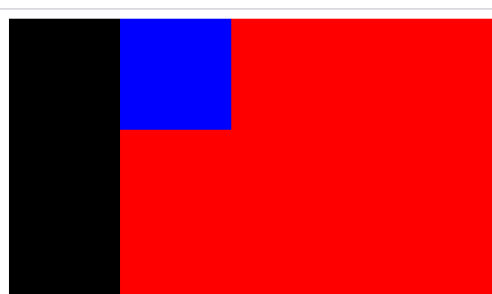
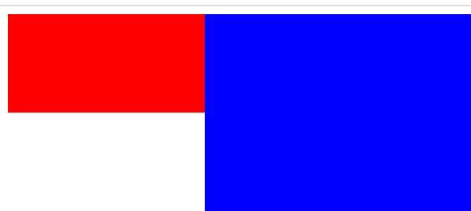

#  块环境上下文（BFC）

```
https://developer.mozilla.org/zh-CN/docs/Web/Guide/CSS/Block_formatting_context
https://developer.mozilla.org/zh-CN/docs/Web/CSS/CSS_Flow_Layout/Intro_to_formatting_contexts
```


**什么是BFC**

```
	块格式化上下文（Block Formatting Context，BFC） 是Web页面的可视CSS渲染的一部分，是块盒子的布局过程发生的区域，也是浮动元素与其他元素交互的区域。
```

**有什么作用**

```
	解决外边距合并：
		首先，外边距合并的原因是因为在同一个BFC下的结果，所以我们可以针对不同的
		对于不同的BFC也不会造成外边距和合并。所以可以使用BFC来解决外边距合并的问题。
	清除浮动：
		可以清除浮动，对于清除浮动，只能清除同一BFC的浮动。
	自适应两栏布局：
		可以做一个横向的两栏布局，一个宽度固定作为一个BFC，另一个做成另一个BFC。
```


## 创建方式

```
	根元素（<html>）
	浮动元素（元素的 float 不是 none）
	绝对定位元素（元素的 position 为 absolute 或 fixed）
	行内块元素（元素的 display 为 inline-block）
	表格单元格（元素的 display 为 table-cell，HTML表格单元格默认为该值）
	表格标题（元素的 display 为 table-caption，HTML表格标题默认为该值）
	匿名表格单元格元素（元素的 display 为 table、table-row、 table-row-group、table-header-group、table-footer-group（分别是HTML table、row、tbody、thead、tfoot 的默认属性）或 inline-table）
	overflow 计算值(Computed)不为 visible 的块元素
	display 值为 flow-root 的元素
	contain 值为 layout、content 或 paint 的元素
	弹性元素（display 为 flex 或 inline-flex 元素的直接子元素）
	网格元素（display 为 grid 或 inline-grid 元素的直接子元素）
	多列容器（元素的 column-count 或 column-width (en-US) 不为 auto，包括 column-count 为 1）
	column-span 为 all 的元素始终会创建一个新的BFC，即使该元素没有包裹在一个多列容器中（标准变更，Chrome bug）。
```


## 常用的 BFC 方式

HTML根元素

浮动， 不能为 `none`

绝对定位， 包括 `absolute `和 `fixed`

表格	包括，表格布局和表格元素

overflow	计算值不为 `visible` ，这里说的是计算值

弹性布局	`flex`

网格布局	`grid`


​		`display: flow-root`，一个新的 `display` 属性的值，它可以创建无副作用的 BFC。在父级块中使用 `display: flow-root` 可以创建新的 BFC。

​		给 `<div>` `display: flow-root` 属性后，`<div>` 中的所有内容都会参与 BFC，浮动的内容不会从底部溢出。


### 解决外边距合并

这个我前面有写有，并且这个只需要不处于同一个BFC就可以有效果。所以这里不做过多说明，就简单的贴一个代码就行。

```
<!DOCTYPE html>
<html lang="zh">
<head>
  <meta charset="UTF-8">
  <title>Title</title>
  <style>
    .f {
      display: inline-block;
      background-color: red;
      height: 90px;
      width: 100px;
      margin-bottom: 20px;
    }
    .c {
      margin-top: 20px;
      height: 100px;
      width: 200px;
      background-color: blue;
    }
  </style>

</head>
<body>
<div class="f"></div>
<div class="c"></div>
</body>
</html>
```


### 清除浮动

​		从下面的例子可以看出。

​		从结果可以看到，当一个元素创建了一个BFC之后，其内部的所有元素都会影响。对于根元素f（red），子元素c（blue），子子元素cc（black）。red的高度被其black所影响。而因为blue没有形成一个BFC，所以虽然black属于blue的子元素，但是blue没有将高度撑开为 black 的高度。

**注意：**使用clear清除浮动，不是BFC的效果。因为我们可以直接对父元素使用clear发现并不会撑开盒子，所以并没有产生BFC。

```
<!DOCTYPE html>
<html lang="zh">
<head>
  <meta charset="UTF-8">
  <title>Title</title>
  <style>
    .f {
      display: flow-root;
      background-color: red;
    }

    .c {
      /*float: left;*/
      height: 100px;
      width: 200px;
      background-color: blue;
    }

    .cc {
      float: left;
      height: 300px;
      width: 100px;
      background-color: black;
    }
  </style>

</head>
<body>
<div class="f">
  <div class="c">
    <div class="cc"></div>
  </div>
</div>

</body>
</html>
```

结果




注意点：如果设置了高度，那么父元素则不会进行扩张。

以及对一个元素的 before和 after伪类进行了 BFC ，并不会将 BFC 给到该元素上。


### 两栏布局

就是，先指定一个的宽度，然后令其浮动，此时第二个的盒子将会位于第一个下面，然后，在将第二个盒子设置成一个BFC，所以就会出现他们并排一行，并且第二个盒子不会换行，然后因为默认占比的100%宽度，所以就会有一个自适应的效果。

```
<!DOCTYPE html>
<html lang="zh">
<head>
  <meta charset="UTF-8">
  <title>Title</title>
  <style>
    .left {
      float: left;
      height: 100px;
      width: 200px;
      background-color: red;
    }
    .right {
      overflow: hidden;
      height: 300px;
      background-color: blue;
    }
  </style>
</head>
<body>
<div class="left"></div>
<div class="right"></div>
</body>
</html>
```




