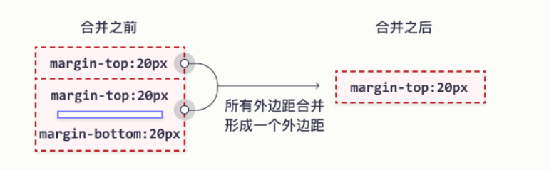

#  外边距合并问题


## 首先，什么是外边距合并

```
https://www.w3school.com.cn/css/css_margin_collapse.asp
https://developer.mozilla.org/zh-CN/docs/Web/CSS/CSS_Box_Model/Mastering_margin_collapsing
https://www.w3.org/TR/CSS2/box.html#collapsing-margins
```


**外边距合并指的是，当两个垂直外边距相遇时，它们将形成一个外边距。**

**合并后的外边距的高度等于两个发生合并的外边距的高度中的较大者。**


简单来说，这个的效果就是，两个外边距并不是进行的相加的边距，而是取了其中的最大值


一个简单的例子

```
<!DOCTYPE html>
<html lang="en">
<head>
  <meta charset="UTF-8">
  <title>Title</title>
  <style>
    * {
      margin: 0;
      padding: 0;
    }

    .f {
      height: 400px;
      width: 800px;
      background-color: red;
    }

    .c {
      height: 50%;
      width: 50%;
      background-color: blue;
      margin-top: 25%;

    }
  </style>

</head>
<body>
<div class="f">
  <div class="c"></div>
</div>
</body>
</html>
```

实际的效果


预想的效果


## 有几种情况会产生外边距合并

### **同一层相邻元素之间**

```
	相邻的两个元素之间的外边距重叠，除非后一个元素加上clear-fix清除浮动。
```

​	相邻元素， 元素包含了，`块级元素`，`行内元素`，`行内块元素`

但是对于 `行内元素`来说，不能使用margin-top，来进行扩张。

对于 `行内块元素`  来说，因为他造成了 BFC，所以，margin-top，没有了合并的效果。

所以，最后还是使用了块级元素。


### **没有内容将父元素和后代元素分开**

```
原话：
	如果没有边框border，内边距padding，行内内容，也没有创建块级格式上下文或清除浮动来分开一个块级元素的上边界margin-top 与其内一个或多个后代块级元素的上边界margin-top；或没有边框，内边距，行内内容，高度height，最小高度min-height或 最大高度max-height 来分开一个块级元素的下边界margin-bottom与其内的一个或多个后代后代块元素的下边界margin-bottom，则就会出现父块元素和其内后代块元素外边界重叠，重叠部分最终会溢出到父级块元素外面。
```

这里的内容，包括了

**第一部分：**

​	**边框：**border	父元素使用，子元素使用并不会有效果。

​	同理，**内边距：**padding，也是一样的。

​	**创建块级格式上下文：**（BFC）我们后面再说：

​	现在我就直接贴上　MDN　的 url

```
https://developer.mozilla.org/zh-CN/docs/Web/Guide/CSS/Block_formatting_context
```

​	**清除浮动：**不知道是要进行什么操作的意思。不知道是不是对子元素进行一次浮动，然后再在父元素上进行清除浮动。


**第二部分：**

​	父元素没有定义高度，所以最终高度会由子元素进行定义，因此，对于 `margin-bottom` 下边界会造成合并的效果。，然后重叠部分会溢出到父元素的外面。


### **空的块级元素**

```
	当一个块元素上边界margin-top 直接贴到元素下边界margin-bottom时也会发生边界折叠。这种情况会发生在一个块元素完全没有设定边框border、内边距padding、高度height、最小高度min-height 、最大高度max-height 、内容设定为inline或是加上clear-fix的时候。
```

简单来说，就是一个空的块级元素

然后对其进行 上边距和下边距的 设置，最终的结果不会是两个相加，

而是选择最大的。

前提就是父元素不能设置

​	border，padding，height，min-height， max-height， display：inline， 和 加上 clear-fix。

对于最后一个clear-fix，有点没有理解清除，其他的还好， display：inline，就是设置成一个行内元素，因为是行内元素，所以外边距就没有效果了。其他的 border，padding，就是一些正常的解决合并问题的方法。


对于空的块级元素，连续相邻的外边距也是会合并的。




### 注意：

- 一些情况的组合会产生更多复杂的外边距离收起。
- 即使某些外边距为0，这些规则仍然适用。因此，父母元素的外边距是0，或最后一个外边距可能会“接触到第一个元素”到父母元素的外面。
- 如果参与折叠的外边距中包含的负值，折叠后的外边距的值为最大的正边距和最大的负边距（即绝对值的最大负边距）和；如果有—— 13px 8px 100px 一叠，远景的技术就是100px -13px的87px。（有负有正，取最大最小相加）
- 如果所有参与的户外边距都为负，折叠后的外边距的最大负边距值为多少。这个规则适用于户外元素和元素。 （全为负，取绝对值最大的。）

```
个人认为：
	这样正负的判断，在修改边距的时候，有一个逐渐的过程，而不会出现突变情况。
```


## 解决外边距合并的办法

首先一点：

​	**只有普通文档流中块框的垂直外边距才会发生外边距合并。行内框、浮动框或绝对定位之间的外边距不会合并。**

行内块不会合并的原因是，他形成了BFC，块格式化上下文。

其他两个是因为他们脱离了普通文档流。


### 解决兄弟元素的上下外边距合并

#### 浮动

虽然浮动可以解决，但是因为是兄弟元素的外边距合并，有时会产生更多的问题。


### 行内块

行内块 display: inline-block;	感觉比上面的好处多了很多。


### 使用绝对定位

​		在这里我知道了一个小知识点，一般对绝对定位的时候都会直接加上 left，top，如果不加的话，那么就会相对于原来的位置不变。虽然也脱离了文档流，不占据的位置，但是从视觉上来说，他是解决了外边框合并的问题。

​	但是如果父元素没有给定高度的话，那么将不会把这个高度计算在内。


### 对于父子元素的外边距合并

#### 设置边框或内边距

避免父子的外边距相邻

```
给父元素加上 border: 1px solid transparent;
```

```
padding: 1px;
```


#### 设置浮动，绝对定位，行内块布局，和overflow

这种的实现就是进行 BFC 块级格式化。

```
float: left;
```

```
position: absolute;
```

```
display: inline-block;
```

```
overflow: hidden;
```

```
overflow: auto;
```


### 对于空的块级元素

#### 设置边框，边距，高度

```
border: 1px solid transparent;
```

```
padding: 1px;
```

```
height: 1px;
```

#### 块环境上下文

比如 

```
display: inline-block;
overflow: hidden;
```

