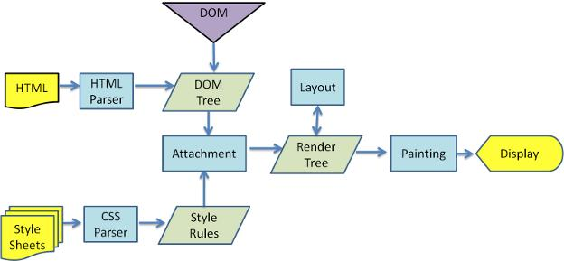

#  浏览器的回流和重绘

```
https://juejin.cn/post/6844903753783443463
```

先放一张图




## 浏览器解析DOM树的过程
  DOM 树其实就是，浏览器用来描述节点信息的数据类型。

* 当浏览器获取到html文件时，开始解析和构造DOM树，我们也知道html文件里面有 JavaScript、 CSS 和 其他文件

  * 遇到了 JavaScript，代码或者文件，在默认情况下，会停止DOM树的执行。因为 JavaScript 可以操作 DOM 。当然也有 defer 和 async 两个模式 

    * ```
      <script defer async></script>
      
      当然这里 defer 和 async 的区别我们后续在讲解。
      ```

    * 但是如果JavaScript操作了CSS，那么就会转而构造CSSOM树。

  * 遇到了CSS 和 其他文件，会先进行下载，CSS 会在DOM树的构造完成之后再进行构造。

* 此时，html已经解析完成，DOM树 和 CSSOM 树也已经构造完成，我们就需要将DOM树和CSSOM树进行渲染为 render tree 或者叫做 layout tree，设置了display:none 的不会出现在渲染树上，但是对于before伪元素，就会出现在渲染树上。

* 生成了渲染树之后，便是进行绘制painting了。

* painting之后便可以进行显示


## 重绘

我们可以知道页面的显示是要先进行渲染树的生成和painting，

而painting就是绘制，重绘就是指渲染树不会重新生成，但是需要重新绘制的情况。

常见的重绘就是颜色的变化，因为他不会引起布局的改变。


## 重排 / 回流

重排就是渲染树重新进行了改变，一般来说就是导致了布局的变化就会导致重排。

重排会引起重绘。但是重绘不一定会引起重排

现在的浏览器也对频繁的重排重绘进行过优化，比如会有维护重排和重绘的队列，只有在达到阈值或者一定时间之后才会进行统一的调用，这样可以减少变化。

当然如果你使用了 clientWidth 这种属性，这一系列属性可以获取到标签的位置信息等的，浏览器会为了拿到一个最精准的属性会强制清空队列。


## 如何减少重排

减少的形式有很多：

* 减少对渲染树的操作，比如可以将多次的操作合并为一个：
  * 使用CSS的类进行操作。
  * 使用display:none 进行操作，因为这样在不显示的情况下是不会引起重排的，然后再操作完之后再显示，那么就只会造成两次重排。
  * 使用 documentFragment，将操作放入这里，然后最后再添加到文档中
* 减少使用属性，利用缓存，减少对属性的请求
* 尽量从末端修改元素
* 可以使用 绝对定位和固定定位，使其脱离文档流
* 使用transform属性代替其他操作。


## transform属性为什么不会引起重排

这里简单来说，就是说浏览器在进行渲染的时候，是将其分成了多个图层，使用的复合图层的形式进行的操作。

当我们调用 transform的时候，会生成一个渲染层，对于这个渲染层会有独立的合成层。因此对其进行修改并不会影响到页面整体的渲染树的重新生成。

就是说，浏览器是将页面分成了不同的图层，然后根据不同的图层进行了划分。然后在显示的时候再根据z-index这种类型的进行一个高低的合成。

**独立的合成层如何产生**：

* 使用了 3D 或者 perspective transform
* video
* canvas
* flash
* opacity
* CSS滤镜 filters
* 存在合成层后代的
* 和合成层重叠且在该层上面渲染的。


