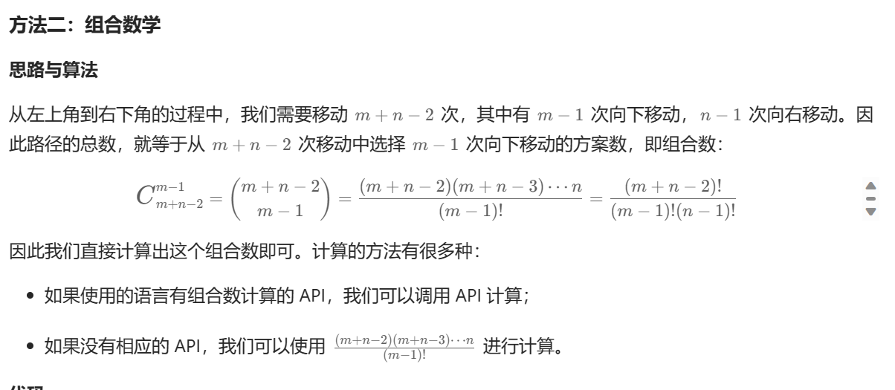

# 不同路径


```
https://leetcode.cn/problems/unique-paths/description/
```

## 描述

一个机器人位于一个 m x n 网格的左上角 （起始点在下图中标记为 “Start” ）。

机器人每次只能向下或者向右移动一步。机器人试图达到网格的右下角（在下图中标记为 “Finish” ）。

问总共有多少条不同的路径？

 

示例 1：


输入：m = 3, n = 7
输出：28
示例 2：

输入：m = 3, n = 2
输出：3
解释：
从左上角开始，总共有 3 条路径可以到达右下角。
1. 向右 -> 向下 -> 向下
2. 向下 -> 向下 -> 向右
3. 向下 -> 向右 -> 向下
示例 3：

输入：m = 7, n = 3
输出：28
示例 4：

输入：m = 3, n = 3
输出：6
 

提示：

1 <= m, n <= 100
题目数据保证答案小于等于 2 * 109


## 算法


### dfs 递归思路

```JavaScript

/**
 * @param {number} m
 * @param {number} n
 * @return {number}
 */
var uniquePaths = function(m, n) {
  let res = 0;
  
  // 递归方法，i，j 表示当前的位置
  // 每次都会往下 或者往右 移动
  const recur = (i, j) => {
    if (i===m && j===n) {
      res++;
      return;
    }
    if (i > m || j>n) {
      return;
    }

    recur(i+1, j);
    recur(i, j+1);
  }

  recur(1, 1)

  return res;
};

```


### dp 动态规划算法

dp[i][j] = dp[i-1][j] + dp[i][j-1];

```JavaScript

/**
 * @param {number} m
 * @param {number} n
 * @return {number}
 */
var uniquePaths = function(m, n) {
  const dp = new Array(m+1).fill(0).map(_ => new Array(n+1).fill(0));
  dp[0][1] = 1;
  for (let i=1; i<=m; i++) {
    for (let j=1; j<=n; j++) {
      dp[i][j] = dp[i-1][j] + dp[i][j-1];
    }
  }

  return dp[m][n];
};

```


### 数学思路

这个因为首先是没有什么阻挡的，
所以每一行的移动方式数量都是可以计算出来的。
详情请看 leetcode



```JavaScript
var uniquePaths = function(m, n) {
    let ans = 1;
    for (let x = n, y = 1; y < m; ++x, ++y) {
        ans = Math.floor(ans * x / y);
    }
    return ans;
};

```
