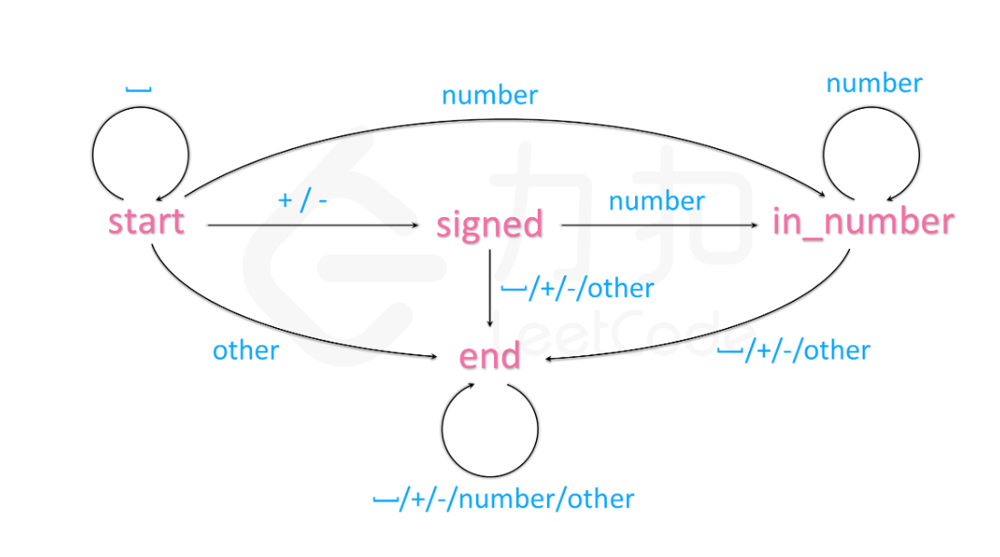
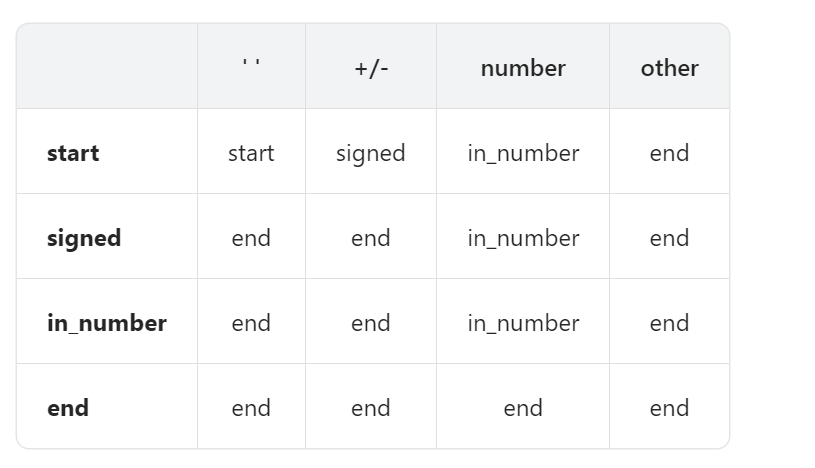

# 字符串转换整数 (atoi)

```
https://leetcode.cn/problems/string-to-integer-atoi/description/
```


## 描述

请你来实现一个 myAtoi(string s) 函数，使其能将字符串转换成一个 32 位有符号整数（类似 C/C++ 中的 atoi 函数）。

函数 myAtoi(string s) 的算法如下：

读入字符串并丢弃无用的前导空格
检查下一个字符（假设还未到字符末尾）为正还是负号，读取该字符（如果有）。 确定最终结果是负数还是正数。 如果两者都不存在，则假定结果为正。
读入下一个字符，直到到达下一个非数字字符或到达输入的结尾。字符串的其余部分将被忽略。
将前面步骤读入的这些数字转换为整数（即，"123" -> 123， "0032" -> 32）。如果没有读入数字，则整数为 0 。必要时更改符号（从步骤 2 开始）。
如果整数数超过 32 位有符号整数范围 [−231,  231 − 1] ，需要截断这个整数，使其保持在这个范围内。具体来说，小于 −231 的整数应该被固定为 −231 ，大于 231 − 1 的整数应该被固定为 231 − 1 。
返回整数作为最终结果。
注意：

本题中的空白字符只包括空格字符 ' ' 。
除前导空格或数字后的其余字符串外，请勿忽略 任何其他字符。
 

示例 1：

输入：s = "42"
输出：42
解释：加粗的字符串为已经读入的字符，插入符号是当前读取的字符。
第 1 步："42"（当前没有读入字符，因为没有前导空格）
         ^
第 2 步："42"（当前没有读入字符，因为这里不存在 '-' 或者 '+'）
         ^
第 3 步："42"（读入 "42"）
           ^
解析得到整数 42 。
由于 "42" 在范围 [-231, 231 - 1] 内，最终结果为 42 。
示例 2：

输入：s = "   -42"
输出：-42
解释：
第 1 步："   -42"（读入前导空格，但忽视掉）
            ^
第 2 步："   -42"（读入 '-' 字符，所以结果应该是负数）
             ^
第 3 步："   -42"（读入 "42"）
               ^
解析得到整数 -42 。
由于 "-42" 在范围 [-231, 231 - 1] 内，最终结果为 -42 。
示例 3：

输入：s = "4193 with words"
输出：4193
解释：
第 1 步："4193 with words"（当前没有读入字符，因为没有前导空格）
         ^
第 2 步："4193 with words"（当前没有读入字符，因为这里不存在 '-' 或者 '+'）
         ^
第 3 步："4193 with words"（读入 "4193"；由于下一个字符不是一个数字，所以读入停止）
             ^
解析得到整数 4193 。
由于 "4193" 在范围 [-231, 231 - 1] 内，最终结果为 4193 。
 

提示：

0 <= s.length <= 200
s 由英文字母（大写和小写）、数字（0-9）、' '、'+'、'-' 和 '.' 组成


## 算法

### 自动机

这个简单来说就是使用有穷自动机思路，将一个执行的逻辑以一个二维数组存储判断。





其实主要注意点在于
* 如何判断是否为数字：使用 Number
* 如何将计算的结果变成的正数，一开始就作为数字存储，然后每次往后添加的时候，前面只需要 *10 进行进位即可。


算法


作者：Gatsby
链接：https://leetcode.cn/problems/string-to-integer-atoi/solutions/185648/javascriptzi-dong-ji-guan-fang-ti-jie-de-xiang-xi-/
来源：力扣（LeetCode）
著作权归作者所有。商业转载请联系作者获得授权，非商业转载请注明出处。

```

/**
 * @param {string} str
 * @return {number}
 */
var myAtoi = function(str) {
  // 自动机类
  class Automaton{
    constructor() {
      // 执行阶段，默认处于开始执行阶段
      this.state = 'start';
      // 正负符号，默认是正数
      this.sign = 1;
      // 数值，默认是0
      this.answer = 0;
      /*
      关键点：
      状态和执行阶段的对应表
      含义如下：
      [执行阶段, [空格, 正负, 数值, 其他]]
      */
      this.map = new Map([
        ['start', ['start', 'signed', 'in_number', 'end']],
        ['signed', ['end', 'end', 'in_number', 'end']],
        ['in_number', ['end', 'end', 'in_number', 'end']],
        ['end', ['end', 'end', 'end', 'end']]
      ])
    }

    // 获取状态的索引
    getIndex(char) {
      if (char === ' ') {
        // 空格判断
        return 0;
      } else if (char === '-' || char === '+') {
        // 正负判断
        return 1;
      } else if (typeof Number(char) === 'number' && !isNaN(char)) {
        // 数值判断
        return 2;
      } else {
        // 其他情况
        return 3;
      }
    }

    /*
    关键点：
    字符转换执行函数
    */
    get(char) {
      /*
      易错点：
      每次传入字符时，都要变更自动机的执行阶段
      */
      this.state = this.map.get(this.state)[this.getIndex(char)];

      if(this.state === 'in_number') {
        /*
        小技巧：
        在JS中，对字符串类型进行减法操作，可以将得到一个数值型（Number）的值

        易错点：
        本处需要利用括号来提高四则运算的优先级
        */
        this.answer = this.answer * 10 + (char - 0);

        /*
        易错点：
        在进行负数比较时，需要将INT_MIN变为正数
        */
        this.answer = this.sign === 1 ? Math.min(this.answer, Math.pow(2, 31) - 1) : Math.min(this.answer, -Math.pow(-2, 31));
      } else if (this.state === 'signed') {
        /*
        优化点：
        对于一个整数来说，非正即负，
        所以正负号的判断，只需要一次。
        故，可以降低其判断的优先级
        */
        this.sign = char === '+' ? 1 : -1;
      }
    }
  }

  // 生成自动机实例
  let automaton = new Automaton();

  // 遍历每个字符
  for(let char of str) {
    // 依次进行转换
    automaton.get(char);
  }

  // 返回值，整数 = 正负 * 数值
  return automaton.sign * automaton.answer;
};

```

### 正则表达式

就正则表达式。。

```

/**
 * @param {string} s
 * @return {number}
 */
var myAtoi = function(s) {
    const num = s.match(/^\s*[\+-]?\d+/)?.[0] ?? 0;
    const max = 2 ** 31 - 1,  min = (-2) ** 31;
    return num < min ? min : num > max ? max :num;
};

```


