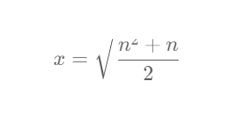

# 找出中枢整数

```
https://leetcode.cn/problems/find-the-pivot-integer/description/
```


## 描述

给你一个正整数 n ，找出满足下述条件的 中枢整数 x ：

1 和 x 之间的所有元素之和等于 x 和 n 之间所有元素之和。
返回中枢整数 x 。如果不存在中枢整数，则返回 -1 。题目保证对于给定的输入，至多存在一个中枢整数。

 

示例 1：

输入：n = 8
输出：6
解释：6 是中枢整数，因为 1 + 2 + 3 + 4 + 5 + 6 = 6 + 7 + 8 = 21 。
示例 2：

输入：n = 1
输出：1
解释：1 是中枢整数，因为 1 = 1 。
示例 3：

输入：n = 4
输出：-1
解释：可以证明不存在满足题目要求的整数。
 

提示：

1 <= n <= 1000


## 算法


### 暴力法

就简单的暴力方式
记录 left=0 right=n
然后分别从 left 和 right 分别相加
那边小那边进行移动。移动到 left===right 
最后，判断两个值是否相等，相等便是满足条件的数 left/right


```JavaScript

/**
 * @param {number} n
 * @return {number}
 */
var pivotInteger = function(n) {
  let left = 1, right = n;
  let leftSum = 0, rightSum = 0;

  while (left < right) {
    if (leftSum < rightSum) {
      leftSum += left;
      left++;
    } else {
      rightSum += right;
      right--;
    }
  }

  return leftSum === rightSum ? left : -1;
};


```

### 数学思维 等差数列求和

记录中枢整数为 x
所以可以得出

sum(1,x) = sum(x, n);
然后通过 等差数列求和公式，计算展开，得出




```JavaScript

var pivotInteger = function(n) {
    let t = (n * n + n) / 2;
    let x = parseInt(Math.sqrt(t));
    if (x * x === t) {
        return x;
    }
    return -1;
};

```