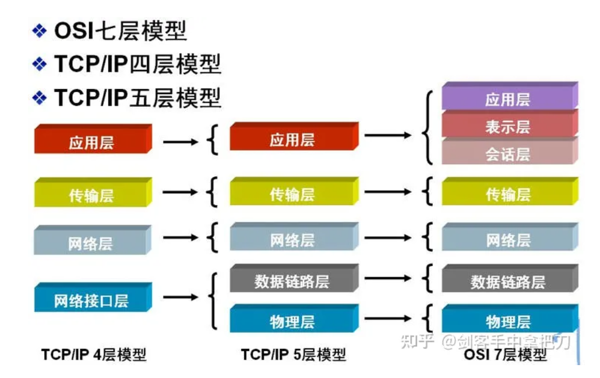

# 网络模型的变迁

## OSI 七层模型

应用层
表示层
会话层
传输层
网络层
数据链路层
物理层

## 四层模型

应用层
传输层
网络层
网络接口层
  包括了 数据链路层 物理层

## 最终合并的五层模型

应用层
  包括了 应用层 表示层 会话层 
传输层
网络层
数据链路层
物理层

如图

# 每一层所对应的协议

## 应用层

### HTTP HTTPS

Hypertext Transfer Protocol
Hypertext Transfer Protocol Secure

最经常使用的请求 超文本传输协议

### DNS

Domain Name System
将域名和IP进行映射

### SMTP

Simple Mail Transfer Protocol
电子邮件协议

### FTP

File Transfer Protocol
文件传输协议

### Telnet

Internet 远程登录服务的标准协议和主要方式

### RPC

Remote Procedure Call
远程调用协议

## 传输层

### TCP

Transmission Control Protocol
面向连接的，可靠的，基于字节流的传输协议

### UDP

User Datagram Protocol
面向无连接，不可靠，基于数据报文的协议

## 网络层

### IP

### ARP 

在 TCP/IP 模型中属于 网络层
在 IOS 模型中属于 数据链路层
地址解析协议 Address Resolution Protocol
通过IP地址获取物理地址的协议

### RARP

同上
属于 反向地址转换协议 Reverse Address Resolution Protocol

## 数据链路层

帧

## 物理层

以太网