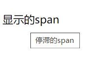

#  HTML-span

在学习的时候发现


```
<span title="停滞的span">显示的span</span>
```



在页面上，鼠标进行放置可以显示 title，这个是一个html的title的特点。我们可以尝试对很多标签设置title，可以看看是否有效果。

## title

对一个标签添加 **title** 就可以实现。

## 出现方式

在一个标签的范围内，进行移动，超过了一定的时间就会显示。

## 对于嵌套

```
<div style="height: 200px; border: 1px red solid;" title="div">
  <span title="停滞的span">显示的span</span>
</div> 
```

```
在外面的会显示的是div，在span内部的会显示span，这个就像极了，在冒泡阶段进行stop。
```

