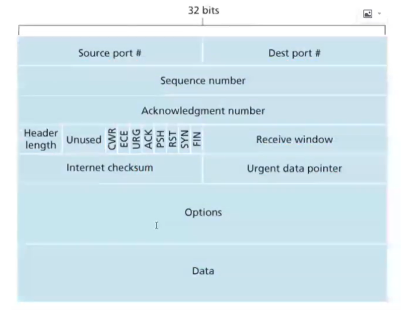
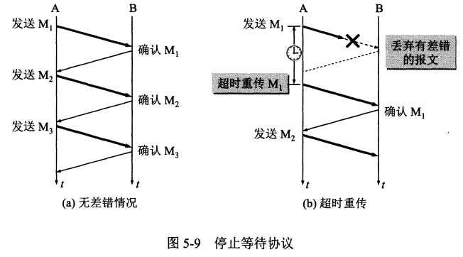
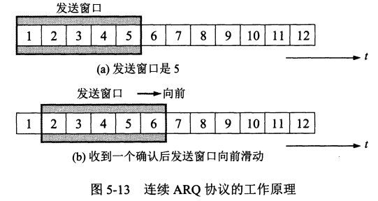
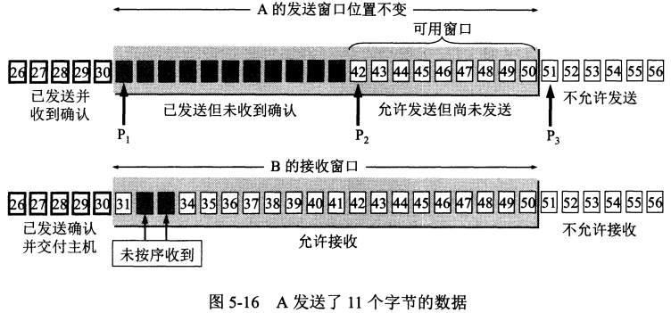
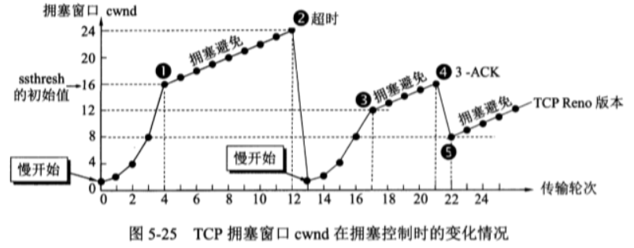
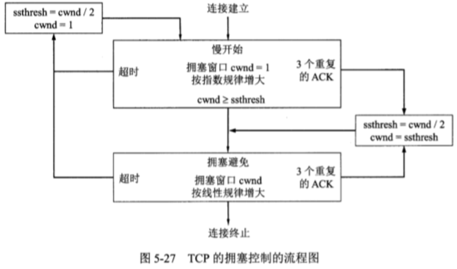
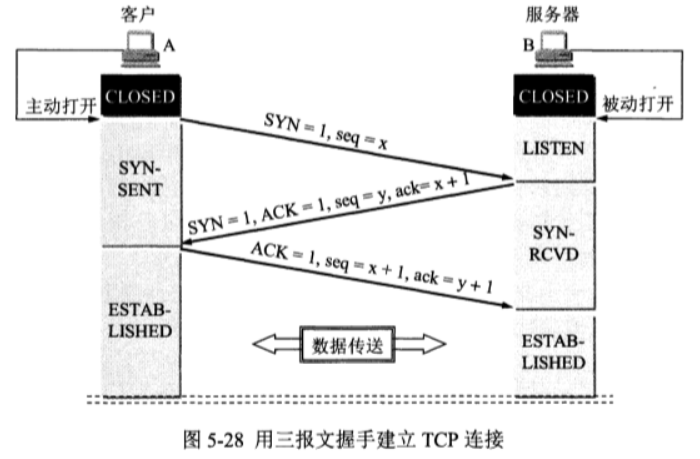
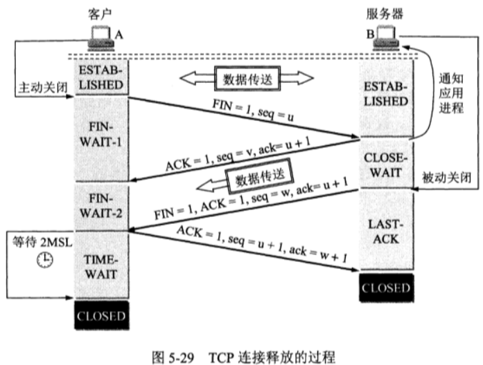

#  TCP

* 首先TCP属于传输层
* 面向连接的传输层协议
* 一对一的连接
* 提供可靠交付服务
* 全双工通信
* 面向字节流：指的是流入到进程或从进程流出的字节序列


​		TCP并不关心应用一次把多长的报文发送到TCP缓存中，而是根据对方给出的窗口和当前网络拥塞的程度来决定一个报文应该包含多少个字节。


## 报文格式




```
URG: Urget pointer is valid (紧急指针字段值有效)
SYN: 表示建立连接
FIN: 表示关闭连接
ACK: 表示响应
PSH: 表示有 DATA数据传输
RST: 表示连接重置。
seq：序号
ack：确认序号
```


## TCP和UDP的区别


| TCP                                            | UDP                                                |
| ---------------------------------------------- | -------------------------------------------------- |
| 面向连接                                       | 无连接，即发送前不需要先建立连接                   |
| 提供可靠交互，无差错，不丢失，不重复，按序到达 | 尽最大努力交付，不保证可靠交付                     |
| 面向字节流                                     | 面向报文                                           |
| 一对一的连接                                   | 支持一对一，一对多的通信                           |
| 拥塞控制                                       | 没有拥塞控制，所以不会使发送率降低，因此会出现丢包 |
| 首部较大20字节                                 | 只有8字节                                          |


## 可靠传输的工作原理

* 停止等待协议
  * 
* 连续arq协议
  * 


## TCP可靠传输的实现

* 滑动窗口
  * 


## 拥塞控制方法

​		慢开始和拥塞避免



​		计算方式




## TCP三次握手



步骤：

* 客户端主动打开，进行连接，SYN=1，seq=x，状态为SYN-SENT
* 服务器处于LISTEN状态，等待客户端开始连接，接收到客户端的连接之后，返回 SYN=1，ACK=1，seq=y，ack=x+1，状态修改为SYN-RCVD
* 客户端收到连接之后，发送 ACK=1，seq=x+1，ack=y+1，此时就代表了客户端已经成功收到，处于了ESTAB-LISHED状态。
* 服务器收到之后，也处于了ESTAB-LISHED状态
* 开始进行数据传送。

**一句话简述**：

```
客户端发起连接请求，
服务器收到连接请求，发送了确认报文。
客户端收到确认报文，发送自己的确认报文，并准备传输数据。
服务器收到了客户端的确认报文，准备接收数据。
```


## TCP四次挥手



**步骤：**

客户端A，服务器B

* A主动关闭，发送 FIN=1，seq=u，状态置为 FIN-WAIT-1
* B收到关闭信息，先返回确认报文，ACK=1，seq=v，ack=u+1，状态：CLOSE-WAIT
* 此时因为B可能还有数据传输或者数据处理，所以不会马上关闭
* A收到确认信息，状态：FIN-WAIT-2
* B数据传输结束，准备关闭，返回关闭确认，FIN=1，ACK=1，seq=w，ack=u+1，状态：LAST-ACK
* A收到了确认关闭的信息，发送确认收到报文，ACK=1，seq=u+1，ack=w+1，同时状态：TIME-WAIT。
* 这里为什么A没有马上关闭是因为，如果B没有收到最后的确认报文，就不会关闭会重复发送，所以这里A等待了2MSL，（MSL叫做最长报文段寿命(Maximum Segment Lifetime)），所以在2MSL之后，关闭了连接，状态：closed
* B收到确认，关闭连接，状态：closed

**一句话简述**：

```
客户端发送关闭，
服务器确认收到并返回确认，但是此时服务器可能有数据进行传输，所以没有马上关闭
服务器传输结束，返回关闭确认
客户端收到关闭确认，返回确认
服务器收到确认，关闭
客户端等待了2MSL，来回最长报文段寿命后，关闭。
```

